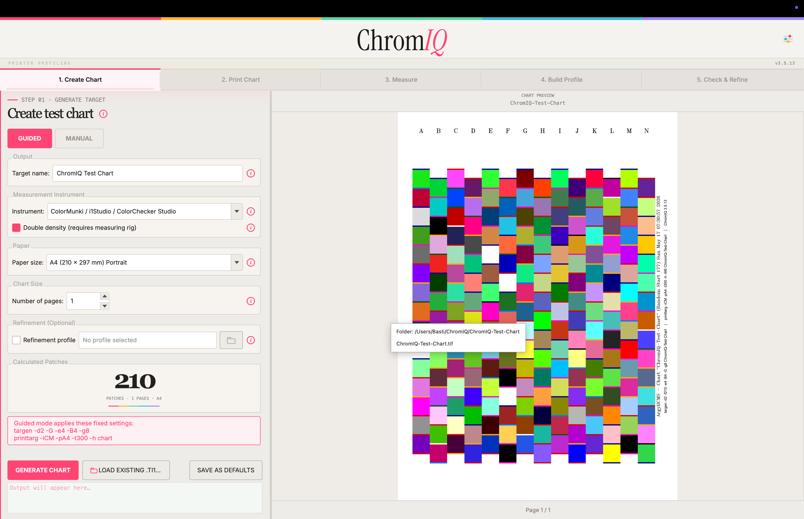

# Changelog

## v3.7.4
Follow-up to v3.7.3 that fixes how the welcome dialog interacts with
the main window's saved size / state on startup, plus a small visual
fix to one of the workflow-card icons.

### Fixes
- **Welcome dialog is now non-modal.** The startup popup used to be
  shown via `dlg.exec()`, which blocks the Qt event loop. On macOS that
  block preempts the OS-level fullscreen / maximize animation triggered
  by `showFullScreen()` / `showMaximized()` during launch, leaving the
  main window at its plain geometry. The dialog now opens via `show()`
  with a stored reference (cleared on close) so it never blocks the
  event loop. A repeat click on the masthead "?" raises the existing
  dialog instead of opening a second one.
- **Explicit state re-apply is now deferred.** `showFullScreen()` /
  `showMaximized()` on launch are scheduled via
  `QTimer.singleShot(0, ...)` rather than called inline immediately
  after `win.show()`. On macOS a same-tick state change request can be
  dropped because the OS hasn't yet processed the show; a 0-timer
  guarantees we run on the next event-loop iteration.
- **Welcome-dialog startup delay reduced to 100 ms.** With the modal
  preemption gone, the 250 ms safety margin from v3.7.3 is no longer
  needed; the dialog just waits for the main window's initial paint.
- **"Measure a chart I already printed" card icon has even spacing.**
  The patches in the strip below the spectrophotometer head were
  drawn with floating-point cell widths that rounded inconsistently,
  producing a visibly wider gap between two of them. The strip is now
  laid out on an integer grid so every patch and gap is identical.

### Welcome-dialog content pass
- **Build my first ICC profile** — step 1 now mentions choosing the
  number of pages alongside instrument, paper and chart name.
- **OS-specific colour-management note** in every print step (first
  profile, 2-pass first and second passes, improve existing). On macOS
  ChromIQ disables driver colour management automatically and the user
  just needs to verify nothing in the dialog re-enabled it; on Windows
  and other systems they still have to switch it off themselves.
- **Build a high-quality profile (2-pass)** — step 3 (measure) now
  contains the full bidirectional-reading and white-surface guidance
  instead of pointing back at workflow 1. Old steps 4 and 5 (build
  first .icc + click "Use as Pre-conditioning Profile") are merged
  into one Build-Profile step. The old combined "Print and measure
  the new chart" step is split into separate print + measure steps,
  each with the full guidance.
- **Improve an existing ICC profile** — steps 2 (print) and 3 (measure)
  receive the same full-text treatment as the other workflows; no more
  "see note in workflow 1" cross-references.
- **Build Profile step no longer mentions algorithm / quality.** Those
  pickers are not visible in guided mode (the default), so beginners
  couldn't act on the advice. Every workflow's Build Profile step now
  suggests filling in the optional metadata fields (Description,
  Manufacturer, Copyright) instead — these *are* visible in guided
  mode and get embedded in the .icc header so colour-management apps
  can identify the profile later.

## v3.7.3
**New help window for first-time users.** ChromIQ now opens a welcome /
help dialog on launch that shows eight clickable workflow cards —
"Build my first ICC profile", "Build a high-quality profile (2-pass)",
"Improve an existing ICC profile", "Print an existing test chart",
"Measure a chart I already printed", "Build a profile from an existing
measurement", "Refine an existing profile" and "Visualise a profile's
gamut". Each card opens a numbered step-by-step walkthrough that names
the exact buttons and settings to use on each tab, tinted by the
spectrum stripe so the badge colour tells you which tab you're on.
Optional steps (the guided refinement loop that follows every build)
render with an outlined badge and dimmed italic body. Re-openable any
time from the magenta "?" button in the masthead, next to the
preferences gear. A "Show this on startup" checkbox in the footer
opts out for return users.

The dialog shipped quietly in v3.7.2 marked as work-in-progress; this
release activates it by default and finishes the content pass.

### Features
- **Help window enabled by default.** First-launch onboarding is now
  active out of the box. Existing v3.7.2 users who toggled the
  "Show this on startup" checkbox keep their preference.
- **New workflow card: "Improve an existing ICC profile".** Walks a user
  who already has a working profile for their printer + paper through
  loading it as a pre-conditioning seed on the Create Chart tab and
  building a noticeably more accurate second profile. Painted icon: a
  filled seed cube → magenta arrow → outlined cube with a magenta "+"
  accent, distinct from the two-cube `two_pass` icon. Grid now lays out
  as 3+3+2, with the bottom row anchored to columns 0 and 2 for
  symmetry with the previous 3+3+1 layout.

### Tweaks
- **Full walkthroughs on every workflow card.** The "Print an existing
  test chart", "Measure a chart I already printed" and the two
  build-from-profile cards used to stop at their named step. They now
  carry the user through the remaining tabs explicitly — Measure → Build
  Profile → optional guided refinement — so a beginner never lands at a
  dead end and has to guess which workflow card to open next.
- **Optional refinement steps visually distinct.** Steps marked as
  optional (the Analyse → re-measure → rebuild → re-analyse loop that
  follows every "Build Profile" workflow) now render with an outlined
  step badge and italic, dimmed body text, separating them from the
  required steps in the same sequence.
- **Chart-naming guidance in step 1.** The two full-build cards now
  suggest a chart-naming convention (`Printer_Paper_Date`, no spaces or
  special characters) since that name carries through to every
  downstream file (.ti2, .ti3, .icc).
- **i1Pro sweep direction clarified.** The bidirectional-reading note
  used to say "down-and-up motion"; corrected to "left-and-right" to
  match how chart strips are actually scanned.
- **Chart backing surface clarified.** Switched from "flat dark surface"
  to "white surface (a plain sheet of paper underneath works)" — a
  coloured or dark backing can bleed through thin stock and skew the
  reading.
- **Build Profile result popup wording fixed.** Steps that described the
  install / jump-to-Check-&-Refine popup were tagged as Tab 5 (Check &
  Refine) even though the popup is shown from the Build Profile tab.
  Folded those steps into the Build Profile step so the badge colour
  matches the tab the popup actually appears on.
- **`two_pass` renamed in the title.** "Build a high-quality profile
  (two-pass)" → "Build a high-quality profile (2-pass)", matching how
  the workflow is referred to elsewhere.
- **Card-icon nudges.** The "Build a profile from an existing
  measurement" icon shifted 5 px up; the "Measure a chart I already
  printed" icon shifted 5 px down — both for a calmer visual fit
  against the card title below.
- **No more `targen` jargon in beginner copy.** The `two_pass` card no
  longer mentions targen's `-c` flag; rephrased to "loaded as the
  pre-conditioning profile" to match the rest of the dialog's
  ChromIQ-doing-things voice.

### Fixes
- **Window maximize / fullscreen state preserved across launches.** The
  welcome dialog opening on startup used to interrupt the main window's
  show transition on macOS, dropping the maximize / fullscreen state and
  leaving the window at its plain saved geometry. Two coordinated fixes:
  `closeEvent` now captures `saveGeometry()` (and an explicit
  `window_maximized` / `window_fullscreen` flag) before `self.hide()`,
  so the snapshot reflects the actual window state; and the welcome
  dialog's startup timer is now 250 ms instead of 0 ms, giving the
  show animation time to complete before the modal blocks the event
  loop. After `show()` the main window also re-applies the explicit
  maximize / fullscreen flag as a belt-and-braces guard.

## v3.7.2
Visual polish across both themes. Window and dialog chrome no longer
reads as pure black in dark mode, and every scrollable panel now
fades softly into its surrounding background at the top and bottom
edges instead of being clipped by a hard line.

### Tweaks
- **Dark-mode chrome moved off pure black.** `QMainWindow`, `QDialog`,
  `QTabWidget` and `QTabBar` now use the panel grey (`#181818`)
  instead of near-black (`#101010`) for their outer surfaces. The
  masthead surround, dialog bodies and the strip behind the tab bar
  no longer ring the content in hard black. Light mode is unchanged.
- **Soft fade at scroll edges.** Every scrollable panel — the four
  parameter panes, the gamut volume controls, and any future modal
  scrolls — now gets a vertical gradient at top and bottom that fades
  scrolled content into the surrounding background colour. The fades
  only appear when content actually overflows and hide at the
  top/bottom extremes so they never sit as decoration on a short
  list. Theme-aware: dark mode fades to `#181818`, light mode to the
  warm `#eeece8`. Implemented as a single `FadeScrollArea` widget
  (`ui/fade_scroll.py`) that picks up its colour from the existing
  `apply_theme()` broadcast.

## v3.7.1
Spinbox button polish — both themes. The up/down buttons on non-compact
spinboxes used to leave a noticeable gap between them at the actual
rendered widget height, and the up-button looked ~2 px shorter than the
down-button because Qt's QSS sub-control rendering rounded the heights
in a way that made the down-button overpaint the up-button's lower
edge. Buttons are now flush, equally tall, and a few pixels wider for
a friendlier click target. Compact spinboxes are unchanged.

### Fixes
- **No more gap between up/down buttons (non-compact spinboxes).**
  The buttons were sized for the 28 px minimum spinbox height, but
  inside form rows the spinbox actually renders at ~38 px, leaving a
  visible empty band between the two buttons. Heights have been
  retuned and `subcontrol-origin` switched from `padding` to `border`
  in dark mode (light mode already used `border`) so each button spans
  exactly half of the rendered widget height.
- **Up and down buttons are now the same visible size.** Qt's stylesheet
  engine was adding 1 px to each button's height, causing a 2 px overlap
  in the middle that the down-button painted over. Heights are now
  tuned so the rendered halves meet exactly with no overlap.

### Tweaks
- **Wider spin buttons.** Up/down buttons grew from 18 px to 22 px wide
  and the spinbox text padding from 20 px to 24 px so the value still
  has room.
- **Light-mode arrow micro-nudge.** Up arrow shifted 1 px up, down
  arrow 1 px down, so each icon sits closer to its respective outer
  edge. Dark mode arrows stay centered. Compact spinbox arrows are
  explicitly reset to centered so the offset is non-compact only.
- **Instrument-port spinbox in Manual measure module widened.** The
  fixed-width compact spinbox on the Measure tab's Manual module was
  clipping its value at the new wider button size. Bumped from 55 px
  to 61 px so the digit, frame, and buttons all fit without
  overlapping.

## v3.7.0
SpectroScan capacity overhaul. The patch-count database underreported
SS+A2 by 13% (4000 → 4592) and had small off-by-N drift on the no-LB
side for several papers; both tables have been re-measured against
Argyll 3.5.0. Hexagon patches (-h) are now a first-class option for
the SpectroScan in both Guided and Pro mode, with capacities measured
across all 14 paper sizes (typically +14% more patches per sheet). The
chart UI has been tidied so each instrument only exposes the printtarg
flags that actually affect its layout, and a state-leak bug that
silently injected -h into SS charts after the user had previously
enabled Double Density on ColorMunki is fixed.

### Features
- **Hexagon patches (-h) exposed for SpectroScan.** A new checkbox
  appears in both Guided ("Hexagon patches (packs ~15% more per
  sheet)") and Pro mode ("Hexagon patches"), with a tooltip that
  reflects the SS-specific semantics (hexagonal layout vs. ColorMunki's
  double-density rig). Patch-count display and Auto-estimation in
  Pro mode both honour the new option; e.g. SS+A4 jumps from 1014 to
  1170 patches per sheet when hex is enabled.
- **SpectroScan hex capacity database.** 14 paper sizes × hex on/off,
  measured by `scripts/measure_ss_hex_capacity.py` (binary-searches
  `targen -d2 -f<n>` + `printtarg -iSS -h ... -t300 -m6 -M6 [-L]` for
  the largest count that still fits exactly one page). Values land in
  both `_PER_SHEET_CAPACITY` and `_PER_SHEET_CAPACITY_NO_LB` because
  SS is a flatbed and ignores `-L`.

### Fixes
- **`-h` no longer leaks into SpectroScan charts.** Previously, if you
  enabled Double Density while on ColorMunki and then switched to
  SpectroScan, the checkbox was hidden but its checked state persisted
  and silently added `-h` to the printtarg command. On SS that
  invokes hexagonal layout (23×45 patches on A4 instead of 26×39),
  visually identifiable by columns running only A–W on a 1014-patch
  chart with three columns of empty space. The visibility logic for
  both Guided (`_update_dd_visibility`) and Pro (`_update_manual_lb_visibility`)
  now force-unchecks `-h` whenever the row is hidden, so the state
  can't survive an instrument switch. The arg builders in
  `workflow/chart_creator.py:_build_printtarg_args` and
  `ui/tabs/tab_chart.py` defensively filter `-h` to instruments where
  it's meaningful (CM, SS) and `-L` to strip instruments (i1, p3) so
  even a stale param dict can't reintroduce a no-op flag into the
  command stamped in TIFF metadata.
- **SpectroScan + A2 patch count was 13% under reality.** The
  `_PER_SHEET_CAPACITY` row read 4000 patches/sheet, but printtarg
  actually packs an 82×56 grid = 4592 on A2 with the default margin.
  Re-measured against Argyll 3.5.0 by `scripts/measure_ss_capacity.py`
  and corrected. Smaller no-LB drift on A3/Legal/A4/A4R/Letter/LetterR
  (each off by 1–4) was also corrected; all SS rows now agree between
  the with-L and no-LB tables because SS is `-L`-independent (flatbed
  reads individual patches, not strips).
- **Suppress-left-clip-border (`-L`) hidden for SpectroScan and
  ColorMunki.** It already had no effect on either instrument's
  layout but the checkbox was visible for SS, which was confusing.
  Now only strip instruments (i1, p3) expose the option in both
  Guided and Pro mode.
- **Dynamic relabelling for the `-h` row.** ParameterWidget gained
  `set_display_text(label, tooltip_title, tooltip_body)` so the same
  underlying widget can advertise *"Double density (for measuring
  rig)"* on ColorMunki and *"Hexagon patches"* on SpectroScan,
  matching what the flag actually does for each instrument. Tooltip
  title and body update in lockstep with the label.

## v3.6.7
Light-mode polish across the parameter panels and the Check/Refine
gamut viewer. Every combobox and spinbox body now renders white in
light mode (matching the QLineEdit path fields next to them) and
`BG_INPUT` in dark mode (matching dark-mode QLineEdits), instead of
inheriting the warm-cream surface of the GroupBox they sit inside.
The gamut viewer no longer shows the thin dark line at the top and
left edges in light mode.

### Fixes
- **Light-mode combobox & spinbox bodies are now white when enabled.**
  Two root causes had to be addressed together. (1) The QSS rule
  `QGroupBox { background: LM_BG_SURFACE }` in `ui/light_styles.py`
  was being propagated by Qt's QStyleSheetStyle into descendants'
  `palette.Base`, so every QComboBox / QSpinBox / QDoubleSpinBox body
  inherited the cream section colour — proven via a diagnostic that
  showed `widget.palette().base() = #f7f4ef` on enabled inputs
  despite the input QSS rule setting `background: #ffffff`. The QSS
  rule has been removed; the cream surface is now repainted by a
  new `GroupBoxSurfaceFilter` in `ui/widgets.py` that runs on every
  QGroupBox Polish event and calls `setAutoFillBackground(True)` +
  `palette.Window = LM_BG_SURFACE`. That mechanism does not
  contaminate descendants' Base role, so input widgets inherit the
  app palette's white Base again. `MainWindow.apply_theme` calls
  `reapply_groupbox_surface()` on every theme switch so light↔dark
  toggles update correctly. (2) Even after the contamination was
  fixed, the bodies rendered the warm-grey LM_BG_WIDGET because
  Fusion's `PE_PanelButtonCommand` paints a gradient using
  palette.Light/Mid/Button. Diagnostics on `drawPrimitive`,
  `drawComplexControl`, and `drawControl` overrides in the
  `WinButtonLayoutStyle` QProxyStyle confirmed Qt's QSS engine
  handles QComboBox / QSpinBox painting entirely internally for
  compound widgets and never delegates to the base style — and
  per-widget `setPalette()` calls were being silently reset by the
  QSS engine on the next polish cycle. The fix that did stick is a
  per-widget stylesheet attached in each NoScroll wrapper's
  `__init__`:
  `QComboBox:enabled, QSpinBox:enabled, QDoubleSpinBox:enabled
  { background-color: <palette.base> }`. Per-widget stylesheets
  bypass the QStyleSheetStyle quirk that affects app-wide rules.
  `reapply_input_stylesheet()` rewrites the rule with the current
  theme's `palette.base()` on every `apply_theme()` call, so dark
  mode picks up `#1f1f1f` and light picks up `#ffffff` without
  flicker. The `:enabled` selector scoping leaves the disabled-state
  appearance unchanged.
- **Dark line on the top and left of the gamut viewer in light mode.**
  Two contributing causes addressed. (1) X3DOM applies a default
  2 px dark border to the `<x3d>` element; the wrapper bumps the
  height to `100vh`, so the right and bottom edges were clipped by
  `overflow: hidden` but the top and left remained visible. The
  injected `<style>` in `workflow/gamut_viewer.py:_patch_html()` now
  zeroes border, outline, margin, and padding on `<x3d>` and its
  inner canvas so the X3DOM-supplied border no longer paints at all.
  (2) The wrapper widget in `ui/gamut_panel.py:_make_viewer_widget()`
  used `setContentsMargins(0, 1, 1, 1)` with `border-left: none`, so
  the QWebEngineView sat flush against the container's left edge
  with no frame-bg buffer to hide Chromium surface-edge artefacts.
  The contentsMargins are now symmetric `(1, 1, 1, 1)`; `border-left:
  none` is preserved so the "open on the left" design intent toward
  the splitter handle stays the same.

## v3.6.6
Dialog button-layout polish across the Check/Refine and Build Profile
tabs. Every result dialog now uses the same arrangement: action buttons
clustered on the left with an 8 px gap between them, and the
dismissal button (**Close** or **Done**) pinned to the right edge of
the window — instead of the previous "everything spread evenly" or
"everything grouped right" layouts that made the dismiss button land
in a different place each time the dialog opened. Also fixes one
button arrow that pointed the wrong way and wires the macOS bundle's
version into the OS-level *About ChromIQ* menu item.

### Fixes
- **Profile Quality Assessment dialog button layout.** The button row
  in `ui/tabs/tab_check_refine.py` previously used `addStretch()`
  between every button, so the Close button drifted to a new
  horizontal position every time the dialog opened with a different
  combination of action buttons (Install Profile, Use as
  Pre-conditioning, Guide Me Through Refinement). The layout now adds
  the action buttons first with an 8 px gap, a single stretch, then
  the Close button — yielding a consistent "actions left, Close right"
  arrangement that also right-aligns Close when it is the only button
  shown. Styling via `tint_dialog_primary()` is unchanged, so primary
  accent buttons continue to render correctly in both themes.
- **Build Profile result dialogs pin Done to the right edge.** The
  three result dialogs in `ui/tabs/tab_profile.py` (Apply Calibration
  result, Calibration File Created, Profile Built) all used
  `QDialogButtonBox` with ActionRole + AcceptRole buttons, which on
  macOS groups every button together on the right side of the row.
  Each now uses the same manual `QHBoxLayout` pattern as the
  Check/Refine fix: action buttons (Install, Pre-conditioning, Check
  Profile Quality, Apply Calibration, Go to Create Chart) clustered
  left with an 8 px gap, a single stretch, then Done on the right.
  `done_btn.setDefault(True)` preserves the Enter-key activation that
  `QDialogButtonBox` provided automatically; QDialog's built-in
  Escape-to-reject handling continues to work unchanged. Each
  dialog's `setMinimumWidth()` was bumped (520→580, 560→600,
  640→740 / 700→880) so the new stretch space has room without
  squeezing buttons.
- **Calibration File Created button arrow flipped.** The
  *Go to Create Chart →* button in `_show_printcal_result_dialog()`
  is now labelled **← Go to Create Chart** — the Create Chart tab
  sits to the *left* of Build Profile in the main tab strip, so the
  arrow on the left of the label pointing left matches the existing
  navigation convention used by `← Use as Pre-conditioning` and the
  forward-pointing `Check Profile Quality →` / `Apply Calibration →`.
- **macOS *About ChromIQ* menu now shows the version.** `main.py`
  set `QApplication.setApplicationName()` and
  `setApplicationDisplayName()` but never called
  `setApplicationVersion()` — so macOS's auto-generated *About
  ChromIQ* menu item, which reads
  `QCoreApplication.applicationVersion()`, displayed an empty version
  field. `APP_VERSION` is now imported from `core/version.py` and
  passed to `setApplicationVersion()`. The bundle's Info.plist already
  carried the version (`CFBundleShortVersionString` /
  `CFBundleVersion`, both set from `APP_VERSION` by `ChromIQ.spec`),
  so Finder *Get Info* and the masthead always showed it — this fixes
  the one place that didn't.

## v3.6.5
Polish patch with three visual fixes and one default flip. The
gamut viewer now reliably picks up ChromIQ's tinted accent colours
on every profile and the combined view's illumination is back to
normal, the main tab bar's active-tab colour no longer bleeds into
the next tab (and now reads symmetrically in both themes), the
Settings dialog's Restore Factory Defaults button is readable in
Light mode, and Manual measurement defaults the bidirectional-strip
checkbox off so the instrument can read strips in either direction
without configuration.

### Fixes
- **Gamut viewer colours now reliably tinted on every individual
  profile.** The JS-side ChromIQ accent remap in
  `workflow/gamut_viewer.py:_THEMED_JS` ran at `DOMContentLoaded`,
  but X3DOM had already parsed and cached the GPU buffers via a
  body-script-triggered init by then — so individual profile views
  often showed iccgamut's default colours, while the combined view
  accidentally worked thanks to a second mutation pass from
  `_COMPARE_CONTROLS_JS` at +150 ms. The remap now runs in Python
  via `_apply_chromiq_colors()` against the raw X3D markup before
  X3DOM ever sees the file; the JS only handles the `<Background>`
  node (which has to stay runtime-driven because it reads the CSS
  body background to follow live Light/Dark switches). Mirrored in
  `workflow/viewgam_runner.py` for the combined view. A new
  `_L_CAP = 0.92` clamp keeps the gamut's white tip visibly tinted
  with the accent hue instead of blowing out to pure white.
- **Combined-profile gamut view is no longer doubly-lit.** When
  iccgamut's compare scene was merged into the primary scene as an
  overlay group in `workflow/viewgam_runner.py`, its scene-level
  `DirectionalLight` nodes carried over too — six on top of
  primary's six, roughly doubling illumination on every shape in
  the combined view and making both profiles look much brighter
  than they do alone. New `_strip_scene_level_dupes()` removes
  `Background`, `NavigationInfo`, `Viewpoint`, `Environment`, and
  all three `Light` subtypes from the compare scene before
  merging, so only the gamut geometry carries over.
- **Main tab bar's active-tab colour no longer bleeds into the
  next tab.** `SpectrumTabBar.paintEvent` in
  `ui/spectrum_tab_bar.py` painted every per-tab fill (active body,
  body tint, top accent strip, inactive hint, disabled overlay)
  using `tabRect(i).width()`, which — with `setExpanding(True)`
  plus a custom `tabSizeHint` of `total // n` — produces tabRects
  whose right edge lands on the next tab's first pixel. Each fill
  now reserves 1 px on the right of every tab except the last
  (`paint_w = rect.width() - right_inset`), so the accent strip
  and active body stop cleanly before the separator instead of
  crossing it.
- **Active-tab overlay 1 px shift, per theme.** Building on the
  bleed fix above, the active colour overlay had a residual 1 px
  asymmetry: in Light mode the right edge read as overshooting the
  white body by 1 px; in Dark mode the left edge read as falling
  1 px short of the visible active region. Both observations
  describe the same physical pixel arrangement but contrast
  against opposite-colour reserved columns in each theme. The
  active overlay (body + tint + top accent strip + underline glow)
  now applies a mode-specific 1 px shift: Light mode shrinks the
  right edge by 1; Dark mode (non-first tab) extends the left edge
  by 1 into the previous tab's reserved column. First tab in Dark
  mode is left flush — there's no previous tab to extend into.
- **Restore Factory Defaults button is readable in Light mode.**
  The button in `ui/dialogs/settings_dialog.py` had a hard-coded
  inline `setStyleSheet` of `#f4f4f4` background / `#121212` text
  — i.e. near-white on the near-white settings dialog. Removed
  the inline rule, added `setObjectName("reset_defaults")`, and
  moved the styling into the theme stylesheets. Light mode now
  uses inverted colours (dark `#121212` background, bright
  `#f4f4f4` text) so the button stands out against the warm
  dialog surround; Dark mode keeps the prior light-on-dark
  appearance unchanged. Same dialog: the appearance combo is now
  a `NoScrollComboBox` so accidental scroll-wheel events don't
  change the theme.

### Behavior changes
- **Manual measurement defaults bidirectional-strip recognition
  to enabled.** Under Measure → Manual → Measurement Options,
  "Disable bidirectional strip recognition (-B)" used to ship
  checked by default — meaning chartread always expected strips
  scanned in one direction. It now ships unchecked, so the
  instrument can auto-detect scan direction without
  configuration. Affects the initial UI default
  (`ui/tabs/tab_measure.py:881`), the preset-restore fallback,
  the settings-restore fallbacks, and the
  `MeasureParams.disable_bidir` dataclass default in
  `workflow/measure_manager.py`. The hardcoded tooltip is
  rewritten to match: enable only if chartread repeatedly flags
  the wrong scan direction. The corresponding YAML entry in
  `data/parameters.yaml:-B` and its tooltip were also updated to
  match. Guided-mode bidirectional default is unchanged.

## v3.6.4
Light-mode polish patch covering the gamut viewer and a few widgets
whose colours had drifted from the masthead wordmark. No
workflow-affecting behaviour changes.

### Fixes
- **Gamut viewer 3D scene background now matches the panel frame in
  both modes.** `iccgamut -w` and `viewgam` emit X3DOM HTML with no
  `<Background>` node, so X3DOM fell back to its default near-black
  sky. The HTML body CSS was already theme-aware (`#efebe6` Light /
  `#111111` Dark, patched by `workflow/gamut_viewer.py:_patch_html`),
  but the X3D canvas (which fills the entire viewer at `height:
  100vh`) drew over it with the X3DOM clear colour — so in Light mode
  the gamut panel was dominated by a black canvas that clashed with
  the surrounding warm-beige frame. The injected `_THEMED_JS` now
  reads `getComputedStyle(document.body).backgroundColor` and ensures
  a `<Background>` element exists inside `<scene>` with both
  `skyColor` and `groundColor` set to that value — sky + ground both
  matter because X3D backgrounds are two hemispheres and setting only
  `skyColor` leaves the ground at default pure black, producing a
  half-black horizon split. Mirrored into `workflow/viewgam_runner.py`
  for the combined-profile view. Theme switches re-apply via the
  existing `_apply_mode_styles()` reload path in `ui/gamut_panel.py`
  without re-running iccgamut/viewgam.
- **Opacity / saturation slider grooves now use the wordmark colour
  in Light mode.** Both sliders in the gamut viewer's compare-mode
  controls (`ui/gamut_panel.py`) had the unfilled track hardcoded to
  `#333333` — a cool mid-grey that read as out of place against the
  warm Light-mode palette. The track is now generated by a new
  `_slider_stylesheet()` helper that returns `#1c1b18` in Light mode
  (the masthead "Chrom" wordmark) and keeps `#333333` in Dark mode
  (a white groove against the dark surround would clash). Re-applied
  from `_apply_mode_styles()` so theme switches update the groove
  live without restarting the panel.
- **Settings dialog checkboxes and path-field focus borders no
  longer inherit the global ACCENT cyan.** The previous dark-mode
  block at `ui/dialogs/settings_dialog.py:317–325` cleared the local
  override (`setStyleSheet("")`) expecting the global APP_STYLESHEET
  to take over, but that stylesheet sets `QCheckBox::indicator:
  checked` and `QLineEdit:focus` to `ACCENT = SPEC_CYAN = #37bcd6`
  — which happens to equal the Build Profile tab's accent stop and
  read as if a per-tab tint were leaking into the dialog. The dialog
  now always applies an explicit indicator colour: `#1c1b18` (Light,
  the masthead wordmark) and `#d0d0d0` (Dark, the same neutral grey
  as the Restore Factory Defaults button border). The dialog never
  picks up an accent regardless of which tab is active or how
  `resolve_mode()` resolves on a given open. Light-mode behaviour was
  briefly off by a hex (`#22211F` instead of `#1c1b18`) — both modes
  now anchor to the actual wordmark values.
- **Create Chart "Calculated Patches" big number now anchors to the
  wordmark colour, not the per-tab accent.** The per-tab QSS
  injector in `ui/main_window.py` was setting
  `QLabel#patch_count { color: {color}; }` in Dark mode, where
  `color` is the active tab's spectrum stop — so on Create Chart the
  56 px Georgia patch count rendered as magenta `#ff4573`, not the
  white the spec calls for. Light mode used `#22211f`, also adjacent
  to but not the same as the wordmark. Both modes now set
  `patch_count_color` to the wordmark hex for their palette
  (`#1c1b18` Light / `#ffffff` Dark), so the big number reads as a
  text anchor under the chart parameters instead of as a tab tint.

## v3.6.3
Polish patch covering three small but visible items: Light-mode log
text is now readable across all four tabs, the Measure tab's
existing-`.ti3` checkbox is honest about supporting both refine and
resume, and the macOS app bundle's Info.plist no longer reports the
wrong version in Finder Get Info / About. No workflow-affecting
behaviour changes.

### Fixes
- **Light-mode log text now hue-preserved but darkened per tab.**
  New `_darken_for_light_log()` helper in `ui/main_window.py`
  converts the tab's accent hex into HSL, drops lightness to ~55 %
  of the original (floor 0.22), tames fully-saturated inputs from
  S=1.0 down to 0.70 so violet doesn't crush into deep indigo, and
  applies a small saturation floor (0.75) for medium-sat hues with
  an extra bump (0.92) in the cyan/blue band (0.48 ≤ H ≤ 0.60) so
  the Build Profile tab's teal stays vivid. Resulting per-tab log
  colours: Create Chart `#8c6318` (amber), Measure `#149061`
  (green), Build Profile `#05778e` (teal), Check & Refine
  `#421fb3` (violet). All four land comfortably above the 4.5:1
  WCAG contrast threshold against the log background while staying
  recognisably the same hue family as the tab accent. The QSS
  injector already re-runs on every Light ↔ Dark switch
  (`apply_theme()` calls it directly), so the colour swaps live
  without an app restart. Dark mode is unchanged.
- **Measure tab — "Refine / resume existing measurement (-r)".**
  The chartread `-r` flag covers both re-measuring problem strips
  and continuing an interrupted measurement, but the checkbox label
  in both the Guided and Manual modules only advertised "Refine".
  The post-interruption log message at
  `ui/tabs/tab_measure.py:2475` already pointed users at this same
  checkbox to resume, so the label was actively misleading. Renamed
  the checkbox and its TooltipButton title in both modules, reworded
  the tooltip body's opening line from "Resumes from the existing
  .ti3 file…" to the neutral "Reuses the existing .ti3 file…" so
  it doesn't bias toward one of the two cases, and updated the log
  message string to quote the new label. Body text already mentioned
  both use cases ("re-measure problem strips" and "continue a
  measurement that was interrupted") and stays otherwise unchanged.
- **macOS bundle Info.plist now reports the real version.**
  `ChromIQ.spec` had `CFBundleShortVersionString` and
  `CFBundleVersion` hardcoded to `'3.5.0'`, so every release since
  3.5.0 shipped a bundle that displayed the wrong version in Finder
  Get Info, the macOS "About" sheet, and any system-level version
  query (Spotlight, mdls, etc.) — even though the in-app masthead,
  Settings dialog and log header all read `APP_VERSION` correctly
  via `core/version.py`. The spec now `exec()`s `core/version.py`
  at build time and feeds `APP_VERSION` into both plist keys, so the
  bundle version follows `APP_VERSION` automatically on every
  future release with no second place to remember to bump.

## v3.6.2
Quality-focused patch for the Build Profile tab. Adds the two CIECAM02
viewing-condition flags that `colprof` needs to build correct
perceptual / saturation gamut-mapping tables when a Gamut Source is
supplied, replaces a cluster of three checkboxes in the Manual
gamut-mapping section with one combobox + standalone checkbox, and
flips the default Gamut Source to ClayRGB1998 (Argyll's bit-for-bit
AdobeRGB 1998 equivalent) so fresh installs match the source profile
serious print workflows actually use. Tooltips across the section are
rewritten as plain-English paragraphs and given enough horizontal
room to read.

### New
- **CIECAM02 source / destination viewing conditions (`-c` / `-d`)
  in Manual mode.** Two new combo rows in the Manual panel's Color
  Science group, directly under FWA, exposing the full list of
  colprof viewing-condition presets — `pp` (practical office print),
  `pc` (critical print booth), `mt` (monitor in typical work
  environment), `md`/`mb`, `jm`/`jd` (projector), `pcd`, `ob`, `cx`,
  plus the two `pe` variants. Empty default keeps current behaviour;
  set them to e.g. `mt` (source) + `pp` (destination) and the
  emitted command picks up `-cmt -dpp`, matching the reference
  invocation pros use. This is the bit that materially affects
  profile quality when a Gamut Source profile is supplied via
  `-s`/`-S` — without `-c`/`-d`, colprof falls back to generic
  viewing-condition defaults that don't match any real
  screen-to-print workflow, and the perceptual / saturation tables
  end up wrong. New `src_viewing_cond` / `dst_viewing_cond` fields
  on `ProfileParams` flow through `_build_args` via the same
  `f"-c{val}"` / `f"-d{val}"` no-space append pattern used by
  `-a` / `-q` / `-V`. Wired through all five Manual save/restore
  sites (collect, preset save, preset restore, save-defaults, both
  default-restore paths) so the choice round-trips through named
  Manual presets and the Save-as-Defaults flow. Guided panel
  untouched.
- **Colorimetric-gamut combobox replaces the `-nP` / `-nS`
  checkboxes in Manual mode.** The two side-by-side checkboxes
  (`-nP` "Use colorimetric gamut — perceptual" and `-nS` "Use
  colorimetric gamut — saturation") collapse into one combobox
  with four entries: *Gamut mapping for both* (default), *-nP
  only*, *-nS only*, *-nP -nS* (both intents colorimetric). Every
  combination the old checkboxes could express remains reachable
  — verified end-to-end against the emitted command line. `-nI`
  (Inverse gamut mapping) is conceptually orthogonal (it controls
  B2A inversion, not which gamut shapes an intent) and stays as
  its own checkbox on a second row. Two tiny helpers,
  `_m_colorimetric_combo_values` and `_m_set_colorimetric_combo`,
  translate between the combo's `(bool, bool)` userData and the
  two existing `ProfileParams.no_perc_gamut` / `.no_sat_gamut`
  booleans, so `_build_args` is unchanged and **existing Manual
  presets and saved defaults round-trip into the new combo
  without a migration step** (the on-disk preset JSON and
  `manual2_colprof_no_perc_gamut` / `_no_sat_gamut` /
  `_inv_gamut` settings keys keep their existing names and
  shapes).

### Changed
- **ClayRGB1998 is now the default Gamut Source.** Fresh installs
  now point the Gamut Source path at `ref/ClayRGB1998.icm` (Argyll
  ships this as its bit-for-bit AdobeRGB 1998 equivalent —
  identical R/G/B primaries, gamma 2.2, D65 white point; renamed
  because Adobe won't license the "AdobeRGB1998.icc" name for
  redistribution). Previously the default was `ref/sRGB.icm`. The
  switch matches how serious print workflows actually drive
  colprof: AdobeRGB is the working space photo apps default to,
  and an AdobeRGB-sourced profile renders sRGB images correctly
  too (sRGB fits entirely inside AdobeRGB), while the reverse —
  AdobeRGB images through an sRGB-sourced profile — clips wide
  hues. `_default_gamut_src()` now tries
  `ref/ClayRGB1998.icm → ref/sRGB.icm → assets/profiles/ClayRGB1998.icm →
  assets/profiles/sRGB.icm`, so installs with an older Argyll
  layout still get a sensible default. **Existing users with a
  saved Gamut Source path are untouched** — the new default only
  fires when the user has never saved a value.
- **Bundled `assets/profiles/ClayRGB1998.icm`** alongside the
  existing bundled `sRGB.icm`, on the same Argyll-AGPL
  redistribution basis. `ChromIQ.spec` already bundles the whole
  `assets/` directory, so the new file is packed into frozen
  builds without any spec change.
- **Gamut-mapping tooltips rewritten and widened.** All five
  tooltips touched in this area (`-c`, `-d`, the new colorimetric
  combo, `-nI`, and the Gamut Source `-s`/`-S` description) are
  rewritten as plain-English paragraphs separated by `\n\n` —
  Qt word-wraps each paragraph automatically, so the previous
  hand-wrapped-every-70-chars style was actively fighting the
  auto-wrap when the dialog widened. `min_width` is bumped to
  540–580 px on the long bodies (the `_InfoDialog` cap is
  `max(min_width + 160, 720)`, so passing the larger min gives a
  comfortable ~720 px wrap width). Each new body explains what
  the flag does, when it matters, and which preset to pick for
  the common photographic workflow.

### Fixes
- **"Browse to AdobeRGB.icm in the Argyll ref folder" hint no
  longer points at a non-existent file.** Four places (Manual +
  Guided Gamut Source tooltips, both path-edit placeholders) used
  to advise the user to browse to `AdobeRGB.icm`, which Argyll
  doesn't ship — Adobe doesn't license the name for
  redistribution, so the file is called `ClayRGB1998.icm`
  instead. Updated all four to name the file that actually
  exists, with a one-paragraph note in each tooltip explaining
  why ClayRGB1998 = AdobeRGB so users aren't thrown by the
  unfamiliar name.

## v3.6.1
Follow-up release after v3.6.0 — fixes a visible strip-highlighter
drift during chartread on charts with letters that have thin
crossbars (notably "H") and on multi-character labels (AW, AX, … on
later pages), adds the missing targen `-n` (Neutral Axis Steps) flag
in Manual mode, and finishes the light-mode polish that v3.6.0 left
incomplete around the gamut viewer, parameter dialogs, and disabled
input states.

### New
- **targen `-n` (Neutral Axis Steps) in Manual mode.** New expert
  parameter under Create Chart → Manual → targen, immediately after
  Pre-conditioning Profile (`-c`) since the two work together. Adds
  extra wedge patches along the perceptually-true neutral axis of
  your printer + paper as defined by the pre-conditioning profile,
  rather than the device-space grey ramp that `-g` walks. Useful
  for refinement passes once you already have a first-pass ICC
  profile loaded under `-c`. Tooltip body spells out the
  distinction between `-n` (profile-derived steps), `-g` (device
  RGB ramp), and `-N` (neutral-axis emphasis dial) with worked
  examples. Auto-wires through Save-as-Defaults, the Default
  preset, and named preset save/restore via the existing YAML-driven
  `_manual_widgets` pipeline — no extra plumbing.
- **Live command preview in Manual mode.** A footer info box at the
  bottom of the Manual scroll area now mirrors the guided info box,
  showing the exact `targen` and `printtarg` commands the workflow
  will run, built from the current ParameterWidget state via the
  same `_build_targen_args` / `_build_printtarg_args` logic.
  Updates live on any parameter change (instrument, paper,
  double-density, `-L`, patch scale, margin, 16-bit toggle, pages
  spin, auto-patches toggle). Importantly the preview reflects the
  auto-bumped i1Pro margin (`-m10 -M10`) even though the margin
  widget is expert-only — by mirroring the actual collector instead
  of `ParameterWidget.build_args()` it shows what runs, not just
  what's user-enabled.

### Fixes
- **Strip highlighter no longer drifts after letter "H" or with
  two-character labels.** The TIFF strip-detection algorithm in
  `_detect_stripe_rects` previously split labels with thin
  horizontal crossbars (the letter "H" is the canonical case) into
  two clusters because the column-dark merge gap
  (`max(3, aw // 200)`, ≈4 px at the 1000-px analysis width) was
  tighter than the gap between the two vertical strokes of "H" at
  that scale. From "H" onwards every subsequent strip was off by
  one — reading "J" highlighted "I". The merge gap is now
  `max(8, aw // 100)` (≈10 px at aw=1000), comfortably above
  intra-letter gaps (~5 px) and well below inter-letter gaps
  (~22 px). On top of that, the detector now runs a **median-pitch
  + endpoint regularisation** pass: it computes the median
  centre-to-centre gap, trims leading/trailing clusters whose
  neighbour gap is < 60 % of the median (likely spurious edge
  marks), and resamples a uniform grid between the remaining
  endpoints with `round((right − left) / pitch) + 1` strips.
  Validated end-to-end on three-page A4 charts where page 3 uses
  two-character labels (AW AX AY … BT) — all three pages now
  detect 24 strips with column centres aligned to within 1–2 px.
  Hard-clamped to ±25 % of the raw cluster count as a sanity bound.
- **Settings dialog focus + checkbox colours follow the active
  theme.** The dialog previously hardcoded a near-white focus
  border and indicator fill that read fine in dark mode but
  appeared as low-contrast pale-on-pale in light mode. Now resolves
  the active appearance via `ui.theme.resolve_mode` and either
  applies an ink-coloured (`#22211F`) light variant or drops the
  local override so the global stylesheet cascades through in dark
  mode.
- **Tooltip dialog text colours follow the active theme.** The
  `TooltipButton → _InfoDialog` heading + body were hardcoded to
  white / light-grey and disappeared on the light-mode info-dialog
  background. Now `#22211F` in light mode, original palette in
  dark.
- **Gamut viewer page + frame backgrounds follow the active theme.**
  The WebEngine page background, the surrounding
  `QWidget#gamutViewerFrame`, and the "no data" fallback label all
  baked `#111111` directly. They now read the panel's mode
  (`_current_bg()`) and switch to `#efebe6` in light mode with a
  matching `#d0ccc6` border. The viewer also re-patches the
  background of already-rendered HTML files on theme switch via a
  new `repatch_background()` helper in `workflow/gamut_viewer.py` —
  flipping themes mid-session refreshes the X3DOM canvas without
  re-running `iccgamut`. The `bg` colour is plumbed through
  `GamutViewer.run()` and `ViewgamRunner.run()` so freshly-rendered
  HTML is patched with the right colour from the start.

### Improvements
- **Disabled inputs are visibly greyed in light mode.** Added
  `:disabled` QSS for `QLineEdit`, `QSpinBox`, `QDoubleSpinBox`,
  `QComboBox` (text + chrome dim to `LM_TEXT_FAINT` /
  `LM_BG_SURFACE`), and for `QLabel#param_label` /
  `QCheckBox#param_label` (`#6a6a6a` in dark, `LM_TEXT_FAINT` in
  light), so the off state is obvious in both themes.
  `ParameterWidget` was refactored to route enable/disable through
  a single `set_control_enabled(enabled)` helper that toggles the
  control, the browse button, **and** the row label together —
  without this the label's `:disabled` selector never matched
  because labels weren't being disabled.
- **Log widget uses a bolder mono font in light mode.** Switched to
  `JetBrains Mono` → `Menlo` → `SF Mono` → `Courier New` with
  weight 800 in light mode. Because Qt's QSS `font-weight` doesn't
  always reach a `QPlainTextEdit`'s underlying document on Windows,
  the weight is also pushed via `QFont` directly in `_apply_theme`
  on every theme switch — both the widget font and the
  `QTextDocument` default font are bumped, so the heavier weight
  survives the per-tab QSS re-injection that runs right after.

### Internal
- **`debug_highlighter` setting (default off).** New diagnostic
  flag in `core/settings.py` that, when true, makes
  `_on_stripe_changed` log one line per strip update to both the
  in-app log widget and `chromiq.log` (id, letter, global_idx,
  strips_per_page, page, local_idx). Used to confirm the
  strip-drift diagnosis above; left in place for future detection
  debugging. Page index is rendered 1-based in the log message for
  readability while the internal `page` variable stays 0-based.

## v3.6.0
First minor-version bump in the 3.x line: ChromIQ now ships a full
**Light Mode**, selectable as Light, Dark, or System (Auto) from a new
Appearance picker in Preferences. Auto follows the macOS Appearance
setting and re-skins live when the user flips it. Beyond the new
theme, the guided Measure panel ships with a slightly safer
patch-tolerance default and a long-standing Qt startup warning about
missing font families is gone.

### New
- **Appearance: Light / Dark / System (Auto).** A new `ui/theme.py`
  central applier wraps every theme switch: it selects the palette
  (`make_dark_palette` / `make_light_palette`) and stylesheet
  (`APP_STYLESHEET` / `LIGHT_STYLESHEET`) for the requested mode,
  broadcasts a `set_appearance(mode)` call to every descendant widget
  that opts in, retints the macOS title bar via NSAppearance
  (`Aqua` for light, `DarkAqua` for dark), and re-runs the per-tab
  QSS injector so its hardcoded primary-button and mode-button
  colours track the new theme. The setting persists under
  `appearance` in `core/settings.py` (defaults to `auto`). Auto
  resolves to light/dark via `QStyleHints.colorScheme()` and listens
  for `colorSchemeChanged` in `main.py`, so flipping macOS System
  Settings → Appearance re-skins ChromIQ without restart.
- **Preferences → Appearance picker.** A new `QGroupBox("Appearance")`
  in `ui/dialogs/settings_dialog.py` exposes a single combobox with
  three items — System (Auto) / Light / Dark. Changes preview live;
  OK persists, Cancel reverts to whatever was saved when the dialog
  opened.
- **Full v2 light visuals.** Beyond palette + QSS, the light variant
  re-tints surfaces that paint outside the global stylesheet: the
  `MastheadHeader` swaps to a warm-white header with dark wordmark,
  the `SpectrumTabBar` paints active tabs `#ffffff` / `#22211f` and
  inactive `#e5e2dd` / `#989490`, the `TiffPreview` and `GamutPanel`
  use a `#efebe6` viewer fill (with the WebEngine page background
  matched so the X3DOM canvas doesn't flash dark on first paint),
  the terminal `QPlainTextEdit#log` uses a pale-green
  `#f4f8f5 / #2a6e2a` palette, and `assets/folder/folder_light.svg`
  drives a `#22211f`-tinted folder icon in the Preferences dialog
  (recoloured at load time from the same PNG mask used by the dark
  variant so the line work matches exactly).

### Improvements
- **Patch consistency tolerance default → 0.7.** The guided Measure
  panel now ships with `-T 0.7` instead of `0.5`. The previous
  default was tuned for lab-grade conditions on an i1 Pro 2/3; in
  the field on consumer inkjet + cheaper colorimeters it produced
  too many "inconsistent patch" interruptions. 0.7 still catches
  real ink/printer faults while leaving more headroom for paper
  texture and slight scanning-speed variation. Updated in three
  places — `core/settings.py`, the guided panel's hardcoded init in
  `ui/tabs/tab_measure.py`, and the tooltip body / `parameters.yaml`
  documentation that referenced the old number.

### Other
- **No more `qt.qpa.fonts: Populating font family aliases …` at
  startup.** The QSS font-family chains in `ui/styles.py` and
  `ui/light_styles.py`, plus the `QFont.setFamilies(...)` calls in
  `ui/spectrum_tab_bar.py`, used to list `system-ui`,
  `-apple-system`, `Segoe UI`, `Helvetica Neue`, and the generic
  `sans-serif`. Qt's parser treats every entry as a literal family
  name (no CSS-generic resolution) and pays a ~73 ms alias lookup
  for each one it can't find on the current platform, then prints a
  warning. Trimmed down to just `"Inter"`, which is bundled and
  registered via `QFontDatabase.addApplicationFont(...)` in
  `main.py`, so Qt finds it on the first try, falls back to its
  own default sans-serif if the application font ever fails to
  load, and no longer warns or stalls on startup.

## v3.5.13
Small visual addition to the Measure preview. The green
downward-pointing triangle that marks the active strip at the top of
the chart now gets an upward-pointing twin at the chart's bottom edge
whenever bidirectional strip recognition is enabled — so the user
sees an arrow at each end of the strip's column, reflecting that
chartread will accept the scan from either direction. With the option
checked (bidirectional disabled, the current default) nothing
changes.

### Improvements
- **Bidirectional indicator on the chart preview.** When
  "Disable bidirectional strip recognition (-B)" is **unchecked** in
  either the Guided or Manual Measure panel, `TiffPreview` now draws
  a second `#56d6a5` triangle of the same width and height as the
  existing top arrow, anchored 5 px above the chart image's bottom
  edge with the apex pointing up. The bottom arrow's horizontal
  column tracks the active strip exactly like the top arrow does, so
  the two stay visually paired as chartread advances. When the
  checkbox is **checked** (the default — bidirectional disabled)
  rendering is identical to v3.5.12, just the single top arrow.
  Driven by a new `set_bidirectional(enabled: bool)` setter on
  `TiffPreview`; `_on_start` in `ui/tabs/tab_measure.py` pushes
  `not params.disable_bidir` into the preview just after
  `_collect_params()`, and `_on_measure_done` clears the flag
  alongside the existing `highlight_stripe(-1)` reset so a stale
  bidir state never carries into the next run. Pinning the bottom
  arrow's Y to the chart's bottom edge (instead of mirroring the
  strip's own bottom) keeps it out of the patch grid on multi-strip
  layouts where strip rects sit flush against each other.

## v3.5.12
Three small UX papercuts across the Check/Refine, Measure, and Create
Chart tabs. The result dialog after a profile analysis was clumping its
buttons against the left edge, the green stripe-arrow overlay on the
Measure preview stayed on screen after chartread had already exited
(advertising state that was no longer live), and the file picker for
pre-conditioning profiles dropped the user in `~` with no shortcut to
the OS's ColorSync / Color folder where ICC profiles actually live.

### Fixes
- **Profile Quality Assessment dialog: buttons left-aligned.** The
  popup raised by `_show_result_dialog` in
  `ui/tabs/tab_check_refine.py` was packing Close / Install / Use as
  Pre-conditioning (and optionally Guide Me Through Refinement) into a
  bare `QDialogButtonBox` added straight to the dialog's vertical
  layout. Qt's default packing left-aligned the row, so on the
  Excellent grade where only three buttons render, the right two-thirds
  of the dialog sat empty. The buttons are now individual
  `QPushButton`s laid out in a `QHBoxLayout` with stretches between
  every entry, so they distribute evenly across the dialog width
  regardless of how many actions are visible for the current grade.
- **Measure preview: green stripe-arrow stuck after chartread exited.**
  `_on_stripe_changed` in `ui/tabs/tab_measure.py` calls
  `TiffPreview.highlight_stripe(...)` on every `stripe_changed`
  signal to point at the strip chartread is currently waiting for,
  but `_on_measure_done` never cleared it. The arrow stayed pinned to
  the last-read strip even after the measurement finished, was
  stopped, or errored out — visually claiming the run was still
  active. `_on_measure_done` now resets the highlighter with
  `highlight_stripe(-1)` at the top of the handler so the overlay
  goes away in all three exit paths (clean finish, user-stop,
  instrument error).

### Improvements
- **Pre-conditioning profile picker: ICC/ICM folder shortcuts in the
  sidebar.** Both the Guided wizard's pre-conditioning step
  (`_on_guided_precond_browse` in `ui/tabs/tab_chart.py`) and the
  Manual panel's `-c` Pre-conditioning Profile row (driven by
  `ParameterWidget._browse` reading the new `icc_sidebar: true` flag
  in `data/parameters.yaml`) now seed the file dialog's sidebar with
  the OS-appropriate ICC profile directories — `/Library/ColorSync/Profiles`,
  `/System/Library/ColorSync/Profiles`, and `~/Library/ColorSync/Profiles`
  on macOS; `C:\Windows\System32\spool\drivers\color` and
  `%LOCALAPPDATA%\Microsoft\Windows\Color` on Windows; `/usr/share/color/icc`,
  `/usr/local/share/color/icc`, and `~/.color/icc` on Linux.
  Non-existent paths are silently dropped by the existing
  `_sidebar_urls` filter, so platform-mismatched entries don't show
  up. A new `icc_profile_paths()` helper in `ui/widgets.py` keeps the
  list in one place. Scope is deliberately narrow — only the
  pre-conditioning entry opts in via the YAML flag; the other
  ICC-filtered parameters on the Build Profile tab (colprof's `-s` /
  `-S` gamut-mapping sources) are unchanged.

## v3.5.11
Point release for issue #18 follow-up from soul-traveller: on the HP
Color LaserJet 5550 Bonjour driver, the Print Chart tab still forced
the user to pick a paper tray to reach Page Size and Media Type even
though Paper Source already showed "(not set)" as its default. The
v3.5.6 fix only covered the case where the user *changed* a combo to
"(not set)" — it didn't unlock anything on first build, because the
combo was already at index 0 and `currentIndexChanged` never fired.
This release enables every option combo from the start, renames the
neutral label so its meaning is obvious, and reworks the downstream
re-filter so changing an upstream combo refreshes every combo below
it (not just the immediate next one).

### Fixes
- **HP Bonjour: Page Size / Media Type stayed locked at default (#18).**
  `_rebuild_option_rows` in `ui/tabs/tab_print.py` used to enable only
  the first combo and rely on `currentIndexChanged` to unlock the rest
  sequentially. That signal never fires for the initial selection, so
  drivers whose Paper Source has no "Auto" entry left the user staring
  at two greyed-out controls. All combos now start enabled; the cascade
  still resets and re-filters downstream selections when an upstream
  combo changes interactively.
- **Downstream combos re-filtered too late.** `_on_option_changed` only
  repopulated `combo_index + 1`, leaving combo `+2` with whatever value
  list it had on initial build. With all combos live from the start
  that became visible — a user who flipped Paper Source could see
  stale Media Type entries until they touched Paper Size. Split out a
  `_repopulate_next` helper and walked the cascade forward across every
  remaining combo so the value lists stay in sync with preceding
  selections.

### Other
- **"(not set)" → "Printer Default" on Print Chart option combos.**
  Per soul-traveller's suggestion on #18: the literal label read as
  "this is broken / nothing chosen", but the actual semantic is "let
  the driver decide" — which is also exactly what macOS's own print
  dialog calls "Auto Select" for `InputSlot`. Same behaviour, clearer
  word. Also dissolves the parallel "Auto Select is missing from
  ChromIQ's Paper Source combo" complaint — `InputSlot` "Auto Select"
  isn't a PPD-declared value, it's the macOS dialog's name for passing
  no `InputSlot` at all, which is what selecting Printer Default now
  does.

## v3.5.10
Follow-up on issue #23, raised by Knut on the printerknowledge forum and
in GitHub. When a strip kept failing on his ColorMunki, the misread
dialog's "Give Up" button quit the entire run and discarded everything
— not what the label promised, and not what chartread actually offers
at that prompt. This release replaces that single button with three
honest options (Retry / Skip Stripe / Save Partial & Quit), wires up
real auto-resume after a partial save (the checkbox auto-arms and the
Start button relabels itself to "Continue Measurement"), and corrects
a misleading line on the calibration-resume dialog that claimed a
per-strip marker chartread never actually prints.

### Improvements
- **Misread dialog: Retry / Skip Stripe / Save Partial & Quit (#23).**
  The old two-button "Retry / Give Up" dialog
  (`_on_strip_error` in `ui/tabs/tab_measure.py`) misnamed Esc-quit
  as "Give Up" and gave no way to skip a single bad stripe. The new
  layout exposes three actions that match chartread's actual control
  surface, all driven through `workflow/measure_manager.py`:
  - **Skip Stripe** chains any-key (→ strip menu) + `n` (next unread)
    via the existing `send_post_retry_key()` helper. Lets you bail on
    a problem stripe and finish the rest.
  - **Save Partial & Quit** chains any-key + `d` (done) + auto-`y`
    against chartread's `"At least one unread patch, Are you sure
    [y/n]"` prompt via a new `send_save_partial_and_quit()` helper
    and a tiny `_save_partial_state` state machine driven by
    `_ARE_YOU_SURE_RE`. This is the only sequence that makes
    chartread write the `.ti3` with patches still unread — Esc at
    the misread prompt discards everything, so the destructive path
    is no longer offered in this dialog (the Stop button at the top
    of the tab is still there as the escape hatch).
- **Auto-resume after an interrupted measurement.** When a run ends
  with a fresh `.ti3` on disk but chartread never emitted
  `"ALL ROWS READ"` (Save Partial & Quit, or `d`+`y` typed manually),
  `_on_measure_done` now re-runs `_update_resume_availability()` to
  surface the "Refine existing measurement (-r)" checkbox, auto-ticks
  it for the active mode, and a new `_refresh_start_button_label()`
  flips the Start button text to **"Continue Measurement"**. One
  click resumes chartread with `-r` against the just-saved partial
  file — no need to reload the `.ti2` or hunt for the option.
  Wired to `toggled` on both `_resume_cb` and `_m_resume_cb` so the
  label tracks manual ticks too.

### Fixes
- **Calibration-resume dialog claimed a non-existent strip marker.**
  The "Calibration Complete — Manual Re-measurement" body in
  `_on_calibration_done` told users that already-measured strips were
  marked with `(!! ALL ROWS READ !!)`, but that line only appears when
  *every* strip has been read, not as a per-strip tag. Rewritten to
  describe what the user actually does (re-scan to overwrite, scan
  unread strips to fill them in) rather than asserting anything about
  chartread's output formatting.

### Other
- GitHub Discussions enabled on the repo (#21) — the
  "Question / discussion" link on the New Issue page now resolves
  to the Discussions tab instead of returning a 404.

## v3.5.9
Forum-feedback release driven by printerknowledge.com post #148124. The
headline is the i1Pro family's intermittent "not enough patches read"
error during chartread: the default 6 mm page margin left so little room
past the last patch that the strip-reader optics drifted onto the bare
paper edge and ended the strip early. This release auto-bumps the
margin to 10 mm for i1Pro / i1Pro 2 / i1Pro 3 / i1Pro 3 Plus, recomputes
the per-sheet patch capacity tables for the new margin (measured against
real printtarg output, not estimated), folds the same fix into the
guided workflow silently, and rolls in three adjacent forum complaints
about preview duplication, Perceptual+Saturation profile builds, and
chart traceability.

### Fixes
- **i1Pro "not enough patches read" — margin auto-set to 10 mm.** The
  per-instrument default margin map (`data/patch_db.py`) now reports
  10 mm for `i1` and `p3` and the original 6 mm for `CM` / `SS`.
  Guided mode applies it transparently (info label shows `-m10 -M10`
  for i1Pro / A3+ runs); Manual mode pre-selects it in the `-m` widget
  the moment the user picks an i1Pro instrument, but never overwrites
  a non-default value the user typed by hand (so a deliberate 12 mm
  survives flipping instruments back and forth). The patch-per-sheet
  database gained `_PER_SHEET_CAPACITY_M10` and
  `_PER_SHEET_CAPACITY_M10_NO_LB` with 56 measured values covering
  every paper size that still fits patches at 10 mm; `query_patches`
  takes an explicit `margin_mm` kwarg so live patch-count displays and
  chart generation share the same numbers. Tiny papers (127×178,
  4×6) drop out of the i1/p3 tables at -m10 because the strip simply
  doesn't fit — those combos fall through to the binary-search
  fallback in `workflow/chart_creator.py`.
- **Single-page chart showed "Page 1/2" in the preview** — the
  forum-reported "two pages, next button still active" symptom on a
  single-file chart. Root cause: `pathlib.Path.glob` is
  case-insensitive on Windows, so `glob("*.tif")` and `glob("*.TIF")`
  both matched the same file and the preview received each path twice.
  `_printtarg_done` now wraps the glob results in a set comprehension
  before sorting (`tests/test_chart_creator.py::test_printtarg_done_dedupes_case_insensitive_glob`
  guards the regression).
- **Perceptual + Saturation profile build no longer crashes colprof
  with a missing source profile.** `_default_gamut_src` now prefers
  Argyll's `ref/sRGB.icm` and falls back to a newly-bundled
  `assets/profiles/sRGB.icm` so fresh installs without Argyll's ref
  folder still get a valid default. A pre-flight `_validate_gamut_source`
  in `_on_build` aborts with a clear dialog ("Gamut source profile not
  found at <path>. Browse to a valid .icm/.icc or switch to None.")
  whenever the field is empty or the path no longer exists, instead of
  letting colprof exit non-zero mid-build.
- **`targen failed with code 1` in Manual mode** when the user clicked
  Generate with `-f0` and no `-g` / `-s` patches either. Targen exits
  with "Must have some single or multi dimensional RGB or CMY steps".
  A pre-flight check in `_on_generate` now catches this and writes a
  clear message into the log ("Set a non-zero Total Patch Count, enable
  the Auto checkbox, or set Grey/Single steps") without spawning the
  subprocess.
- **Manual chart parameter settings corrupted by Windows registry
  case-insensitivity.** `manual_targen_-g` (Grey Axis Steps, int) and
  `manual_targen_-G` (Good Mode, bool) collided in HKCU; `-G='true'`
  overwrote `-g`'s int slot and triggered `set_value(-g, 'true')`
  warnings on every restore. Single-letter alpha flag keys now get a
  `_u` / `_l` case suffix in storage (`manual_targen_-g_l`,
  `manual_targen_-G_u`), one-time migration silently discards
  type-incompatible legacy values and deletes the bare-flag key. The
  same trap existed latently for every other case-twin flag (`-d/-D`,
  `-c/-C`, `-b/-B`, `-s/-S`, ...) and is now closed off.

### Improvements
- **Chart TIFFs are self-documenting via right-edge metadata stamp.**
  Forum feature request: after printtarg writes its own vertical ID
  line on the long edge (`ArgyllCMS — Chart "name" (Random Start NNN)
  <date>`), ChromIQ now stamps a parallel rotated line containing the
  exact `targen` and `printtarg` commands used to produce the chart
  plus the ChromIQ version, in the widest white run of the right
  margin. Pixel-level guarantees: every column to the left of the
  detected writable band is byte-identical pre/post; bit depth (uint8
  /uint16), photometric, compression, ICC profile, ImageDescription,
  Orientation, XPosition/YPosition, ResolutionUnit (cm stays cm), and
  effective DPI are all preserved exactly. Strip layout
  (StripOffsets/StripByteCounts/RowsPerStrip) is the only unavoidable
  re-encoding artefact; the image renders identically. Implementation
  in `workflow/tiff_metadata.py`, tested under both 8-bit and 16-bit
  in `tests/test_tiff_metadata.py`.
- **Manual chart tab gained a "Chart notes" field and a "Stamp commands"
  toggle.** Notes (e.g. *Canon Pro-1000 / Hahnemühle Photo Rag 308*)
  ride along on the same right-edge stamp when filled. The checkbox
  defaults to on and persists across sessions; turn it off to keep the
  stamp clean (notes-only, or empty entirely). The notes field
  intentionally does not persist between sessions — notes are
  per-chart context, not a default.
- **Bundled `assets/profiles/sRGB.icm`** (Argyll's AGPL-redistributable
  source profile, 3 kB) so a fresh ChromIQ install gives a working
  Perceptual+Saturation default without needing the user to point at
  Argyll's ref folder first.
- **Guided info label now shows the effective margin flag** —
  `printtarg -ii1 -pA4 -t300 -L -m10 -M10 chart` — so users can see at
  a glance which margin is being applied and why the patch count
  differs from a fresh ColorMunki run on the same paper.
- **New `scripts/measure_margin10_capacity.py`** automates the
  binary-search measurement of per-sheet patch capacity at any margin
  for any instrument × paper × `-L` combination. Used to populate the
  margin-10 tables in this release; ready to reuse if a future tester
  reports the same scanning-jig issue at a different margin.

## v3.5.8
Log readability pass driven by tester feedback against v3.5.7. The
on-disk log file (`~/Library/Logs/ChromIQ/chromiq.log` on macOS,
`%LOCALAPPDATA%\ChromIQ\Logs\chromiq.log` on Windows) accumulates
output from every session back-to-back, and with no visual cue for
session boundaries or in-app navigation it had become hard to tell
which lines belonged to which run, or which tab was active when an
error happened. This release adds two scannable markers and bumps
the rotation cap so a typical day of use stays in one file.

### Improvements
- **Session banner on every startup.** `configure_logging` now
  writes a three-line `===` banner to `chromiq.log` before any
  log handlers are attached, stamped with the local time, app
  version, platform, and Python version. The banner is appended
  directly to the file (not routed through the logging
  framework) so it lands above the first log line of the new
  session and visually separates it from the tail of the
  previous one. Failures to write the banner are swallowed so a
  read-only log dir can never block app startup.
- **Tab-change marker in the log.** `MainWindow._on_tab_changed`
  now logs `---- Tab → <name> ----` at INFO on every switch,
  including the initial tab restored from settings at startup.
  The `----` prefix scans visually when scrolling a long log,
  so it's quick to find the section of output that belongs to a
  given step in the workflow.
- **Rotation cap raised from 2 MB × 4 to 5 MB × 5.** The
  `RotatingFileHandler` previously kept ~8 MB of history; a
  long session with verbose `chartread`/`colprof` output could
  rotate the earliest part of the day out before the user
  noticed a problem. The new ~25 MB ceiling keeps a typical
  day in a single file while still bounding disk use.

## v3.5.7
Windows reliability work driven by tester reports against v3.5.6. The
headline is a defensive rewrite of the chartread keystroke path on
Windows (#20): a missing ctypes `restype` truncated `CreateFileW`'s
HANDLE on 64-bit Windows, so calibration prompts and `<esc>` could
silently fail. The new bindings, INFO-level send-key logging, and a
12-second no-response watchdog mean the next time chartread stops
responding the log file actually shows what happened and the user
sees a recoverable warning instead of a frozen dialog. A second
Windows fix forces the native OS print dialog regardless of stored
setting, so a stale `use_native_print_dialog=False` carried over
from an older install can't strand a Windows user on the CUPS/
PostScript bypass UI (the Settings checkbox is hidden on Windows
because the bypass UI has no working path there).

### Fixes
- **Chartread keystrokes silently dropped on Windows (#20).** The
  Windows interactive path attaches to chartread's hidden console
  and injects keystrokes via `WriteConsoleInputW`. The supporting
  `CreateFileW(\\.\CONIN$)` call had no `restype` declared, so
  ctypes treated its pointer-sized HANDLE return as a 32-bit signed
  int and truncated the high bits on 64-bit Windows — the
  subsequent invalid-handle check then misfired and the
  `WriteConsoleInputW` call could write into the wrong handle or
  return silently. All Win32 bindings (`AttachConsole`,
  `FreeConsole`, `CreateFileW`, `WriteConsoleInputW`,
  `CloseHandle`, `GetLastError`) now have explicit `argtypes` and
  `restype`, and the invalid-handle sentinel is derived from
  `c_void_p(-1).value` so it survives the pointer width.
  `_win_inject_key` returns a bool that propagates out via a new
  `ArgyllRunner.keypress_failed` signal.
- **Native print dialog forced on Windows.** A stale
  `use_native_print_dialog=False` carried over from older installs
  stranded Windows users on the CUPS/PostScript bypass UI, which
  has no working path on Windows. The Settings checkbox is hidden
  there (gated on `native_print_supported()`, macOS-only), so
  users had no way to flip it back. `AppSettings.get` now
  overrides the value at read time so Windows always reports True
  regardless of what QSettings has stored.

### Improvements
- **Diagnostics for chartread interactive sessions.** Every
  keystroke sent to chartread is now logged at INFO with the human
  label (`ESC`/`CR`/`SPACE`/`LEFT`/`RIGHT`/letter), the chartread
  PID, and the outcome (`OK`/`FAIL`), so the local app log
  (`%LOCALAPPDATA%\ChromIQ\Logs\` on Windows,
  `~/Library/Application Support/ChromIQ/Logs/` on macOS) contains
  an audit trail of what the user pressed and whether it reached
  the instrument. Previously this was at DEBUG and absent from the
  user-facing log file, which is why the v3.5.6 hang report in
  #20 could not be diagnosed from the user's logs.
- **No-response watchdog on the Measure tab.** When a dialog
  sends a keystroke to chartread (calibration, retry, give-up,
  "press d to finish"…) and no output comes back within 12
  seconds, the tab now prints a `[WARN]` line and flashes the
  status bar telling the user the key may not have reached the
  instrument and suggesting they retry or click Stop. Doesn't
  auto-abort — the Stop button stays in their hands — but the
  app no longer pretends to be working when it isn't. Injection
  failures returned by the new Win32 path also surface
  immediately via the same `[WARN]` channel.

## v3.5.6
Tab 2 (Print Chart) fixes from tester reports against v3.5.5. The
headline is the macOS "ChromIQ quit unexpectedly" crash at app shutdown
after switching printers (#19): the root cause was orphaned option-row
widgets accumulating across printer changes and surviving into
`QApplication` teardown with live signal connections, where SIP could
then follow a half-freed wrapper. Along the way, two visible Tab 2
quirks from the same tester (#18) — a stray unlabeled combo box drifting
above the option list, and being forced to pick a paper tray on the HP
Bonjour driver even when wanting the printer default — are gone too.

### Fixes
- **macOS quit-unexpectedly after printer change on Tab 2 (#19).**
  `_rebuild_option_rows` builds each option row as a nested
  `QHBoxLayout` whose `QLabel` and `QComboBox` are parented to the
  `TabPrint` widget, not the layout. The old cleanup loop only deleted
  top-level widgets in the options layout, so the inner widgets were
  detached from the layout but kept alive as orphan children of
  `TabPrint` — one extra set on every printer switch, each still
  holding a `currentIndexChanged` lambda connection. At quit, Qt's
  parent-child teardown plus the live connections gave SIP a window to
  follow a dangling wrapper and `EXC_BAD_ACCESS`. Two-part fix: the
  rebuild cleanup now recursively deletes nested layouts and
  disconnects each combo's signal before `deleteLater`, and a new
  `TabPrint.shutdown()` runs from `MainWindow.closeEvent` to reparent
  and drain the option widgets via the same `processEvents` pump
  already used for the `QtWebEngine` shutdown race. Models on
  `ui/gamut_panel.py::shutdown_webengine`.
- **Stray unlabeled combo box above the option list (#18).** Same
  orphaned-widget bug above, surfaced visually: leftover combos from
  prior printer selections stayed as children of `TabPrint`, drifting
  into view as a small label-less "A3" pulldown over the Printer row.
  The recursive layout cleanup removes them at the moment of rebuild
  instead of letting them accumulate.
- **HP Bonjour driver no longer forces a tray selection (#18).** When
  the user picked `(not set)` on the Paper Source combo — the only way
  to defer to the printer default on drivers that ship no "Auto"
  option — the sequential-enable logic in `_on_option_changed` kept
  Paper Size disabled, so the user was stuck. `(not set)` now unlocks
  the next combo with its full value list (nothing to filter against
  when there's no preceding choice), matching the behaviour the user
  would expect from leaving an option at its default.

## v3.5.5
UX polish driven by tester feedback on the measure tab and the chart-
import flow. The headline is a much tighter default patch-consistency
check (so a clogged nozzle or low ink shows up at measurement time
instead of poisoning the resulting profile) plus the ability to
overwrite an existing profile folder when importing an external
chart. Smaller touch-ups to the import-dialog button bar, the settings
dialog button spacing, and the preview-header tooltip styling round
out the release.

### Features
- **Overwrite existing folder when importing a chart.** When the
  profile name typed into the "Copy Chart Files" dialog collides with
  an existing folder under the working directory, the OK button is
  swapped for an "Overwrite existing folder" action. Clicking it pops
  a confirmation listing the full path that will be deleted before
  the import proceeds; the previous behaviour silently rejected the
  name with no way forward. Works for charts loaded from outside the
  working folder (via Tab 2 → Load existing chart and via the Measure
  tab's loader) as well as the "Use as base for a new profile" branch
  when the chart already sits inside the working folder. Self-
  collision (overwriting the source chart's own folder) is guarded
  with an inline error, so `shutil.rmtree` can never delete the file
  the user is currently importing.

### Improvements
- **Patch consistency tolerance default lowered from 1.0 → 0.5.** The
  chartread `-T` flag is a multiplier on the built-in patch-read-
  consistency threshold, not an absolute delta-E. A tighter setting
  catches real problems early — clogged inkjet nozzles, low ink,
  dirty drum rollers, drifting laser toner — at chart-read time
  instead of letting them poison the profile silently. Argyll's stock
  1.0 is too forgiving on healthy hardware; experienced users on
  printerknowledge.com run 0.4 with i1 Pro 2 / 3. 0.5 leaves a little
  headroom over the community benchmark while still flagging
  pathological reads. The tooltip is rewritten in plain language to
  explain what `-T` actually multiplies, when to lower it (good
  printer, strict QA), and when to raise it to 0.8–1.5 (textured,
  matte, or fine-art papers where the surface itself contributes
  variance).
- **Manual measure: patch consistency tolerance is now on by
  default.** The guided panel already pre-activates `-T`; the manual
  panel did not, so users had to remember to tick the checkbox every
  session. Added `manual2_chartread_tolerance_enabled: True` to the
  DEFAULTS dict so the manual panel matches the guided one out of the
  box. Any value the user has explicitly saved with "Save as
  defaults" still wins on subsequent launches — this is just about
  the first-run state.
- **Import dialog button bar redesigned.** Replaced the
  `QDialogButtonBox` (which on macOS hugs the right edge) with a
  custom layout: primary action (OK or Overwrite, depending on
  collision state) on the left, Cancel pushed to the right by a
  stretch. OK and Overwrite share the same slot — only one is visible
  at any time — so the collision case reads as a clean two-button
  layout rather than a three-button squeeze. Dialog widened from
  500 px to 580 px so the longer Overwrite label has room. Enter
  still confirms OK when it's visible; when only Overwrite is
  visible, Enter is intentionally a no-op so the destructive action
  needs an explicit click.
- **Settings dialog button spacing.** Restore Factory Defaults,
  Report a Bug, and Check for Updates on the left now share the same
  gap as OK ↔ Cancel on the right, by querying
  `bb.layout().spacing()` and applying it as the bottom-row spacing.
  Replaces the previous mix of hard-coded 8 px gaps and the style-
  driven 6 px QDialogButtonBox gap so the bar reads as one visually
  unified row.

### Fixes
- **Guided panel was stuck at the old 0.7 tolerance.** A post-
  construction `opt.widget.setValue(0.7)` in `_make_guided_panel`
  (left over from the v3.1.2 default) was overriding the new 0.5
  spinbox constructor default. Fixed in place. Also updated
  `measure_tolerance_value` in `core/settings.py` DEFAULTS to 0.5 so
  `_restore_defaults()` doesn't reseed the spinbox with the stale
  value at startup. Users who previously clicked "Save as defaults"
  with 0.7 will keep that saved value (intentional — respects user
  choice); restoring factory defaults or saving 0.5 explicitly
  refreshes it.
- **Preview header tooltips rendered with a transparent background
  on macOS.** When a `QLabel` carries `background: transparent` in
  its own QSS, the global `QToolTip` rule fails to reach that
  label's tooltip popup — the popup falls back to the macOS native
  rendering and inherits the transparency. The image-body tooltip
  also lost its left border because `_img_label`'s
  `border-left: none` was bleeding into the tooltip. Added a global
  `QToolTip { background: #262626; color: #e6e6e6;
  border: 1px solid #404040; padding: 4px; }` rule to
  `APP_STYLESHEET`, plus a per-widget `QToolTip` block on each
  preview label, with the existing label declarations scoped inside
  `QLabel { … }` so they no longer leak. All three preview tooltips
  (caption, filename, image body) now render dark with a clean four-
  sided border.

## v3.5.4
Follow-up to v3.5.2 for issue #15: after the 16-bit colorimage fix, the
HP Color LaserJet 5550 (firmware ~2005) kept pulling each profiling
sheet back through its duplexer, and "Print All Pages" paired two
charts onto opposite sides of the same sheet — producing one corrupted
half-print. The printer was honouring its panel-side duplex default
instead of the CUPS `Duplex=None` option.

### Fixes
- **Duplex forced off at the PostScript layer.** Profiling charts are
  always single-sided, but `lp -o Duplex=None` is just a CUPS-level
  hint and some older firmware ignores it in favour of the printer's
  panel/PPD default. The PS document now declares `/Duplex false
  /Tumble false` inside its `setpagedevice` block, which the printer's
  PostScript interpreter has to honour — same mechanism we already use
  for `/PageSize`. Devices without a duplex unit silently ignore the
  key per the PS spec, so the change is harmless for the rest of the
  supported printer set. Also added `sides=one-sided` to the lp
  options as belt-and-suspenders for PPDs that filter `setpagedevice`
  keys but accept the IPP keyword. Regression-tested by pinning the
  emitted block in `test_setpagedevice_disables_duplex`.

## v3.5.3
Quality-of-life release for the Manual chart workflow: pick a page count,
tick **Auto**, and let ChromIQ size the patch count to fill exactly that
many sheets. Also fixes a long-standing bug in the patch-fitting binary
search that made custom patch scales produce partially-filled pages.

### Features
- **Auto patch count in Manual mode.** New "Auto" checkbox next to the
  total patch count spinbox in the basic targen parameters, paired with a
  new "Pages" spinbox under printtarg → paper size. When Auto is on, the
  patch count is computed at Generate-target time from the current paper,
  instrument, double-density, left-border, patch scale, and margin so the
  chart fills the requested page count with no empty space. The patch-
  count spinbox displays "Auto" in place of a number while the option is
  active. The estimate is deferred to the Generate click rather than
  running live on every settings change — custom layouts shell out to
  `targen`/`printtarg` for a binary search, which would otherwise freeze
  the UI on each tweak; progress now scrolls into the log as the search
  runs. Auto state and the target Pages value persist across presets and
  app restarts.

### Fixes
- **`_binary_search` bounds account for `patch_scale`.** The per-sheet
  capacity search used the standard-density (`-a 1.0`) DB estimate to
  seed its `[0.5×, 2.5×]` window. At `patch_scale = 2.0` each patch
  occupies four times the cell area, so the true capacity is roughly a
  quarter of that estimate — the entire search window lived above the
  real value, every probe overflowed, and the loop fell back to its 50-
  patch sentinel. Result: choosing a custom patch scale (or running
  Guided mode for a non-default layout) produced too few patches and
  partially-filled pages. The search now centres on `est / patch_scale²`
  and logs a warning + returns the scaled estimate when no fit is found,
  so a future stuck-loop bug surfaces instead of hiding.
- **Disabled inputs now look disabled.** `QLineEdit`, `QSpinBox`,
  `QDoubleSpinBox`, and `QComboBox` controls inherited their normal
  `TEXT_MAIN` colour even when `setEnabled(False)` had been called,
  making greyed-out fields visually indistinguishable from active ones.
  Added a `:disabled` rule to the global stylesheet that mirrors the
  existing `QPushButton:disabled` palette (dim grey text on a darker
  body). Picked up automatically by every enable-toggling call site.

## v3.5.2
Follow-up bugfix release for issue #15: 16-bit profiling targets loaded
from external bundles now print on older PostScript hardware, and the
`Load .ti1` flow on the Generate Chart tab no longer drops the channel
sidecar.

### Fixes
- **16-bit TIFFs are downcast to 8-bit before `colorimage`.** `printtarg
  -T` (capital T) writes 16-bit charts — common in third-party target
  bundles like the Argyll_Printer_Profiler project. Older HP PostScript
  interpreters (CLJ 5550 firmware ~2005 and similar vintage) silently
  drop jobs whose inline image uses BitsPerComponent=16, even though
  the L3 spec supports it. The PostScript generator now right-shifts
  16-bit samples to their high byte before encoding, so every print
  job goes out as 8-bit `colorimage`. Lossless for profiling — patches
  are flat fills, the 16-bit precision was redundant, and `colprof`
  reads from the `.ti3` measurement file rather than the printed
  image. Verified end-to-end on a synthetic of the reporter's exact
  3307 × 2339 A3-landscape chart.
- **`Load .ti1` on Generate Chart now writes `<stem>.channels.json`.**
  The sidecar guard in `_printtarg_done` checks `self._pending_params`,
  which the normal `generate()` entry point sets but
  `load_ti1_and_generate_preview()` did not — so loading a chart from
  an existing `.ti1` produced a working set of TIFFs but no channel
  sidecar, leaving the preview unable to identify inks in a future
  session. Mirrors the `generate()` path now and is covered by
  `tests/test_chart_creator.py`.

## v3.5.1
Bugfix release addressing a silent print-job failure on memory-constrained
PostScript printers and a handful of preview-clarity rough edges reported
against v3.5.0.

### Fixes
- **Print Chart: PostScript output now uses `/FlateDecode` + ASCII85
  instead of raw ASCII-hex.** Profile charts compress extremely well
  (large uniform patches), so a representative 16-bit A3 chart at 200 dpi
  shrinks from ~90 MB to ~0.3 MB of PostScript — bit-exact identical
  pixel data feeding `colorimage`, just a tighter wire format. Fixes
  issue #15: HP Color LaserJet 5550 and similar PS-interpreter-
  constrained printers were silently dropping the oversized job ~20 s
  after accepting it. The emitted PostScript LanguageLevel bumps to 3
  (universal on every printer ChromIQ targets); the existing TIFF
  raster fallback in `CupsRawPrinter` still handles L2-only edge cases.
- **Build workflow: macOS arm64 + universal2 matrix legs no longer
  race-fail on release creation.** The loser of the `gh release create`
  race now detects the 422 "already exists" response, continues, and
  uploads its DMG to the release the winner created.

### Preview clarity
- **Loaded chart name shown above every TIFF preview.** Generate Chart,
  Print Chart, and Measure tabs now display the chart stem directly
  beneath the section caption ("CHART PREVIEW" / "PRINT PREVIEW"),
  so it's always obvious which target is loaded. Hover the caption,
  the filename, or the dark image area to see the working folder and
  every per-page TIFF file name; the cursor changes to a help-style
  pointer over the header text as a discoverability cue.
- **Gamut Volume panel shows the loaded ICC profiles.** Under the
  "GAMUT VOLUME" header in Check & Refine, profile A and (when set)
  profile B stems appear as `A: <stem>   B: <stem>`. Full paths on
  hover, same as the TIFF previews.
- **Header height collapses when no chart is loaded** so the section
  caption hugs the preview area like before — extra height only
  appears when there's actually a filename to display.

### Workflow
- **Measure → Print cross-tab sync.** Loading an existing `.ti2` in
  the Measure tab now also populates the Print tab, mirroring the
  existing Print → Measure direction. The auto-sync skips
  `resolve_ti2`'s "Continue / Use as base for a new profile" dialog
  because the chart has already been resolved on the originating tab.

## v3.5.0
First stable release of the 3.5.x line, rolling up the six 3.5.0 betas
into a single supported build for macOS, Windows, and Linux.

### Highlights since v3.2.8
- **Linux support.** Pre-built tarballs for `x86_64` and `aarch64`
  ship with every release alongside the existing macOS DMGs and Windows
  ZIPs. All platform-conditional paths (Argyll bin defaults, log
  directory, ICC profile install location, gamut viewer ICC dialog)
  now live in `core/platform_paths.py` with explicit Windows / macOS /
  Linux branches. Linux is labelled **beta** in the README — the
  full ArgyllCMS workflow runs, but real-hardware coverage is still
  thin; please report what works and what doesn't.
- **Guided pre-conditioning (second-pass) workflow.** The *Generate
  Chart* tab gains an optional **Refinement** section: tick the box,
  pick an existing `.icc` / `.icm` / `.mpp`, and `targen` runs with
  `-c` for a refinement pass. The *Build Profile* and *Check & Refine*
  result dialogs grow a **Use as Pre-conditioning** button that
  pre-fills the chart panel with the just-built profile, and the prior
  session's `.icc` / `.ti3` are auto-renamed `pre_*.icc` / `pre_*.ti3`
  so v1 isn't overwritten by v2.
- **Per-tab onboarding tooltips.** Every workflow tab now has a
  clickable ⓘ icon next to its big title that opens a beginner-friendly
  explanation of what the screen does, what needs to be ready, how to
  use it, and what comes next. The *Build Profile* tooltip swaps to
  describe the 3-stage `printcal → applycal → colprof` flow when
  calibration mode is enabled, and the *Print Chart* tooltip varies by
  OS and `use_native_print_dialog` (macOS bypass, macOS native dialog,
  Linux CUPS bypass, Windows QPrintDialog).
- **Updater understands SemVer pre-release tags.** Beta users see
  newer betas as upgrade candidates; stable users only see stable
  releases. The "Check for Updates" crash on pre-release builds
  (`int("0-beta")`) is gone.
- **Landscape charts print correctly on the CUPS PostScript path.**
  The generated PostScript now declares its own page geometry to match
  the TIFF aspect, so Apple's `pstops` no longer double-rotates the
  job — HP drivers stop clipping columns A–E or silently dropping
  jobs.

### Other improvements & fixes
- File logger + `sys.excepthook` installed at the top of `main.py`,
  before PyQt6 / numpy are imported, so early import-time failures
  end up in `chromiq.log` with a full traceback instead of vanishing.
- Linux bundle ships nine xcb / xkbcommon helper libs next to the
  binary, so the Qt xcb platform plugin resolves its deps from
  `$ORIGIN` and the tarball launches on minimal distros without
  requiring `libxcb-cursor0` to be installed system-wide.
- Cross-platform icon builder (`scripts/build_icons.py`): generates
  `app_icon.icns` and `app_icon.ico` from PNG using Pillow only, so
  the icon step in `HOW_TO_BUILD.txt` no longer needs macOS-only
  `sips` / `iconutil`.
- GitHub release notes are guaranteed to be non-empty — the workflows
  first try to extract the matching `## <tag>` section from this
  changelog, then fall back to commit subjects since the previous tag.
- Pre-release-style tags (`-alpha`, `-beta`, `-rc`, `-pre`) are
  automatically flagged as GitHub prereleases by the build workflows;
  final tags stay regular.
- Issue forms auto-apply `platform:` and `Severity:` labels via the
  new `auto-label-issues.yml` workflow.
- WebEngine teardown moved from `aboutToQuit` to `MainWindow.closeEvent`
  to dodge the SIP / Chromium shutdown race that caused
  `EXC_BAD_ACCESS` on quit when the gamut viewer had been opened.

### Updating from a 3.5.0 beta
If you're running any 3.5.0-beta.X build, **Check for Updates** will
recognise v3.5.0 as an upgrade and prompt you to install it (final
releases sort above any pre-release of the same base version per
SemVer 2.0.0 precedence rules).

For the full per-beta breakdown of what landed when, see the
`v3.5.0-beta.1` … `v3.5.0-beta.6` sections below.

## v3.5.0-beta.6
### Added
- **Guided pre-conditioning workflow in *Generate Chart*.** A new
  *Refinement (Optional)* section appears on the guided panel: tick
  the checkbox + pick an existing `.icc`, `.icm`, or `.mpp` profile
  and `targen` is invoked with `-c` for a second-pass profiling run.
  The always-on `-G` OFPS distribution plus targen's default `-A=1.0`
  already satisfy the man-page condition for `-c`, so no extra flag
  plumbing is required.
- **"Use as Pre-conditioning" button** on both the *Build Profile*
  and *Check & Refine* result dialogs. Pressing it switches back to
  *Generate Chart* and pre-fills the picker with the just-built
  profile. Both dialogs were widened to fit the new button row plus
  its explanation paragraph.
- File-picker filter on the pre-conditioning field now accepts `.mpp`
  in addition to `.icc` / `.icm`, per the targen man page.

### Changed
- When a refinement run starts in the same working folder, the prior
  session's `<basename>.icc` and `<basename>.ti3` are renamed in
  place to `pre_*.icc` / `pre_*.ti3` instead of being overwritten by
  the upcoming `chartread` / `colprof` runs. `_stage_precond_profile`
  already handles in-folder `pre_` files without re-copying. Only one
  generation of history is kept — diminishing returns past v2.

## v3.5.0-beta.5
### Added
- **Tab-headline tooltips on every workflow tab.** Each of the five tabs
  (Create Chart, Print Chart, Measure, Build Profile, Check & Refine)
  now has a clickable ⓘ icon next to its big title that opens a
  beginner-friendly explanation of what the screen does, what the user
  needs ready (devices connected, paper loaded, …), how to use it, and
  what comes next. The tab 4 tooltip swaps between the standard
  `colprof` and the 3-stage `printcal → applycal → colprof` flow when
  calibration mode is toggled in Settings. The tab 2 tooltip
  additionally varies by OS and by the `use_native_print_dialog`
  setting, so macOS bypass, macOS native dialog, Linux CUPS bypass, and
  Windows QPrintDialog each get their own instructions.

### Fixed
- **Crash on quit when the gamut viewer was active.** PyQt6 plus
  QtWebEngine raced during shutdown: SIP walked the Chromium subtree
  in `QApplication`'s destructor and dereferenced a dangling pointer,
  surfacing as `EXC_BAD_ACCESS` in
  `sip_api_visit_wrappers/dealloc_QApplication`. The WebEngine teardown
  now runs from `MainWindow.closeEvent` (while the event loop is still
  alive) instead of from `aboutToQuit` (which fires too late for posted
  events to drain), and the main window hides itself first so the user
  sees no visible delay.

## v3.5.0-beta.4
### Fixed
- **Check for Updates no longer crashes on pre-release builds** (#16). The
  built-in version parser did `int("0-beta")` on tags like
  `v3.5.0-beta.3` and surfaced as "Check failed: invalid literal for
  int() with base 10: '0-beta'". The parser now follows SemVer 2.0.0
  precedence rules (`3.5.0 > 3.5.0-rc.1 > 3.5.0-beta.3`), and the
  checker queries `/releases` rather than `/releases/latest` so users on
  a beta can be told about a newer beta. Users on a final release still
  only see final releases as upgrade candidates.
- **Landscape charts now print correctly on the CUPS PostScript path**
  (#14, #15). When the chart aspect contradicted the selected paper
  orientation, the generated PostScript declared a portrait page and
  drew the landscape image on top — Apple's `pstops` filter then
  double-rotated, which caused HP drivers to clip columns A–E (#14) or
  silently drop the job (#15). `PostScriptGenerator` now swaps
  `setpagedevice` to match the TIFF aspect, and the CUPS PS command no
  longer forwards `orientation-requested`, so the document fully
  describes its own geometry. The raw-TIFF fallback path still uses
  `orientation-requested` because raw TIFF has no inherent page
  geometry.

### CI
- **Issue forms now auto-apply `platform:` and `Severity:` labels.**
  GitHub issue forms don't turn dropdown selections into labels — only
  the template's static `labels:` array applies. A new
  `auto-label-issues.yml` workflow parses the bug- and feature-form
  bodies on open and adds the matching repo labels
  (`platform: macos|windows|linux|any`,
  `Severity: Critical|High|Medium|Low`). Includes a `workflow_dispatch`
  entry for retroactively labelling existing issues.

## v3.5.0-beta.3
### Fixed
- **Early startup failures are now captured in `chromiq.log`** (#13, rooted
  in #11). The rotating file handler and a `sys.excepthook` are installed
  at the very top of `main.py`, before `PyQt6`, `numpy`, and the UI
  modules are imported. If a frozen bundle ships with a broken dylib
  graph (as happened in v3.2.7 with `libscipy_openblas64_.dylib`), the
  import-time `ImportError` is now written to disk with a full traceback
  instead of vanishing silently. The startup banner also records python
  version, `sys.platform`, `sys.frozen`, and `sys.argv` for diagnostics.

### CI
- macOS, Windows, and Linux release workflows now always include a
  changelog in GitHub release notes. They first try to extract the
  matching `## <tag>` section from `CHANGELOG.md`; if absent (e.g. the
  maintainer forgot), they fall back to an auto-generated bulleted list
  of commit subjects since the previous tag, so releases can never ship
  with empty notes.

## v3.5.0-beta.2
### Fixed
- **Linux: Qt xcb platform plugin crash on launch** — the beta.1 tarball
  aborted on first run with
  `qt.qpa.plugin: From 6.5.0, xcb-cursor0 or libxcb-cursor0 is needed to
  load the Qt xcb platform plugin` on any distro that did not happen to
  have `libxcb-cursor0` installed system-wide. `ChromIQLinux.spec` now
  detects nine xcb/xkbcommon helper libs on the build host and bundles
  them into the tarball next to the binary, so the Qt xcb plugin resolves
  its dependencies from `$ORIGIN` and the bundle launches without any
  system packages required. Reported by the Debian beta tester.

### Docs
- `HOW_TO_BUILD.txt`: retitled to drop the `.app` suffix; macOS-only steps
  (4, 4b, 5, 6 — PyInstaller spec choice, `codesign --deep`, "open .app",
  zip a `.app`) are now explicitly labeled so Linux readers stop reading
  them as cross-platform. Added a Troubleshooting subsection with
  apt/dnf/pacman fallback commands for the xcb-cursor error.
- `README.md`: Linux section gains a one-line troubleshooting note with
  the same fallback install commands.

## v3.5.0-beta.1
### Added
- **Linux support (beta)**: ChromIQ now builds and runs on Debian/Ubuntu and
  other glibc Linux distributions. Pre-built tarballs are produced for both
  `x86_64` and `aarch64` and attached to each release
  (`ChromIQ-Linux-x86_64.tar.gz`, `ChromIQ-Linux-aarch64.tar.gz`). Extract and
  run `./ChromIQ/ChromIQ` — no install step required.
- **Cross-platform icon builder**: a new `scripts/build_icons.py` script
  generates both `assets/app_icon.icns` (macOS) and `assets/app_icon.ico`
  (Windows) from the source PNG using Pillow only — no more macOS-only
  `sips`/`iconutil` dependency, so the icon step in `HOW_TO_BUILD.txt` now
  works on every platform.

### Changed
- All platform-conditional paths and URLs (Argyll bin directory defaults &
  auto-detection candidates, log directory, ICC profile install location,
  gamut viewer ICC profile dialog, ArgyllCMS download page, native-print
  dialog visibility) now live in a single `core/platform_paths.py` module
  with explicit branches for Windows, macOS, and Linux. Previously every
  call site assumed "not Windows" meant macOS, which silently produced
  `~/Library/Logs`, `~/Library/ColorSync/Profiles`, `/Applications/Argyll/bin`
  etc. on Linux. macOS and Windows behavior is preserved exactly (regression
  test: `tests/test_platform_paths.py`).
- On Linux the log file lives at `~/.local/state/ChromIQ/logs/chromiq.log`
  (or `$XDG_STATE_HOME/ChromIQ/logs/`), the default Argyll path is `/usr/bin`
  (also probes `/usr/local/bin`, `/opt/argyll/bin`, `/opt/argyllcms/bin`,
  `~/.local/bin`), installed profiles go to `~/.local/share/color/icc/`
  (or `$XDG_DATA_HOME/color/icc/`), the gamut viewer file dialog lists the
  XDG + colord-managed profile directories (`~/.local/share/color/icc`,
  `~/.color/icc`, `/usr/share/color/icc`, `/usr/local/share/color/icc`,
  `/var/lib/colord/icc`), and the **Download latest ArgyllCMS…** button
  opens the Linux download page on argyllcms.com.
- Profile-install dialog button text reads **Install Profile** on Windows
  and Linux (previously hard-coded **Install on this Mac** on every
  non-Windows OS).

## v3.2.8
### Fixed
- **Intel-only DMG (`ChromIQ-macOS-x86_64.dmg`) failed to launch** with
  `[PYI-3463:ERROR] Could not load PyInstaller's embedded PKG archive from
  the executable`. The v3.2.7 derive-x86_64 step ran `lipo -thin x86_64`
  over every Mach-O in the universal bundle, including the PyInstaller
  bootloader at `Contents/MacOS/ChromIQ`. The bootloader has its onedir
  PKG archive appended *after* the Mach-O slices; `lipo` writes only the
  Mach-O bytes and silently discards the trailing archive, bricking the
  binary. The CI step now skips the bootloader (it stays universal2 — a
  ~1 MB cost; macOS Intel picks the x86_64 slice at exec time anyway).
- **Universal DMG (`ChromIQ-macOS-universal.dmg`) crashed on import numpy**
  with `Library not loaded: @rpath/libscipy_openblas64_.dylib`. numpy 2.4+
  vendors a SciPy-built OpenBLAS dylib that PyInstaller's bundled
  `hook-numpy.py` did not pick up on the universal2 build, leaving
  `Contents/Frameworks/libscipy_openblas64_.dylib` absent. The spec now
  collects numpy's dynamic libs explicitly (`collect_dynamic_libs('numpy')`),
  and a new CI step asserts the OpenBLAS dylib is in the bundle so a hook
  regression can never silently ship again.

## v3.2.7
### Fixed
- **Native macOS print dialog ignored chart paper size**: the new
  Sequoia/Tahoe print panel hides the standalone paper-size control, and
  ChromIQ's native print path never called `setPaperSize_`, so the job
  inherited whatever paper was last in `sharedPrintInfo` (typically
  Letter/A4). With clip pagination set on the print info, charts larger
  than that default were silently cropped at print time. The native
  print path now sets the paper size to the chart's own dimensions
  (computed from the TIFF's resolution tag) before opening the dialog,
  and explicitly enables `NSPrintPanelShowsPaperSize`,
  `NSPrintPanelShowsOrientation`, `NSPrintPanelShowsScaling` and
  `NSPrintPanelShowsPageSetupAccessory` on the panel so the user can
  still override paper / orientation / scale in the dialog or via the
  driver's Printer Options pane.

## v3.2.6
### Fixed
- **Universal DMG launches on Apple Silicon but crashed on Intel Macs** with
  `dlopen … QtGui.framework/Versions/A/QtGui … incompatible architecture`.
  The CI lipo step that fattens arch-specific wheels into universal2 only
  matched `*.so` and `*.dylib` files, so the Qt6 framework binaries (which
  live at `PyQt6/Qt6/lib/Qt*.framework/Versions/A/Qt*` with no extension)
  were silently left arm64-only. `PyQt6-Qt6` and `PyQt6-WebEngine-Qt6` were
  also missing from the merge list entirely. The lipo helper now walks the
  x86_64 wheel by relative path and merges every Mach-O it finds, and both
  Qt framework packages are included — restoring true universal2 builds.

## v3.2.5
### Added
- **Report a Bug button in Preferences**: the bottom row of the Preferences
  dialog now exposes a *Report a Bug…* button that opens the GitHub bug-report
  form (pre-filled with the right template) in the user's default browser.
  Sits next to *Restore Factory Defaults* and *Check for Updates* so all three
  "GitHub / external" actions cluster together on the left of the row, with
  Cancel / OK pinned to the right as before.

### Changed
- **Preferences dialog widened from 840 → 900 px** so the bottom-row buttons
  (Restore Factory Defaults, Report a Bug…, Check for Updates, Cancel, OK)
  all show their full labels without truncation.

### Project
- **Reporting issues & feedback section added to the README**, with deep-links
  that jump straight into the bug-report and feature-request forms (skipping
  the GitHub template chooser). The lone Windows-section feedback link now
  also points at the bug-report form rather than the issues list.
- **`.github/SUPPORT.md` added** so GitHub surfaces a *Help* entry in the
  new-issue chooser sidebar and on the repo's community profile, routing
  users to bugs / features / Discussions / the ArgyllCMS mailing list.

## v3.2.4
### Fixed
- **Stale files reappear after a restart**: with *Restore last session* enabled,
  clearing a `.ti3` / `.icc` / cal-`.ti3` mid-session previously didn't take
  effect on the next launch — the cleared paths still lived in settings and
  were resurrected. `clear_files()` in the Build Profile tab now also nulls
  `_cal_ti3_path` (which was being skipped) and the Measure and Build Profile
  tab clear methods eagerly write empty values to `session_ti1_path`,
  `session_ti3_path`, `session_icc_path`, and `session_cal_ti3_path` instead
  of relying on the quit-time save — so a crash before quit can no longer
  resurrect cleared files.

- **Working-folder name not sanitised against filesystem-illegal characters**:
  `FileManager.set_target_name` previously only replaced spaces with `-`. A
  printer name containing `/` (CUPS permits it) or a manually-typed chart name
  with `:` / `\` / control chars could create unintended subfolders or fail
  outright on Windows. Names are now run through a single `_sanitise` rule
  that keeps alnum / `_` / `-` / `.`, replaces everything else with `_`,
  strips leading and trailing dots (Windows forbids them), and falls back to
  `"session"` if the result is empty. Auto-generated session names are
  unchanged (they were already hyphenated).

- **Dead "high ΔE" warning in the Build Profile result dialog**:
  `ProfileBuilder.sanity_check` contained a regex `r"delta E .{0,10}> 5"`
  that looked for the literal substring `> 5` in colprof's log — which
  colprof never emits, so the warning was unreachable. Removed the dead
  tuple. Real ΔE evaluation already lives in Tab 5 (Check & Refine) via
  `profcheck`. The other two sanity checks (`out of gamut`,
  `Profile creation failed`) and the file-size checks are unchanged.

## v3.2.3
### Fixed
- **Gamut Analysis failed when comparison profile was loaded from
  `/System/Library/ColorSync/Profiles/`** (e.g. `sRGB Profile.icc`):
  ChromIQ copies the comparison ICC into a private temp directory before
  invoking `iccgamut`, and was using `shutil.copy2`, which copies file data
  *and* metadata. macOS system ColorSync profiles carry the SIP-protected
  BSD flag `SF_RESTRICTED` — the data copy succeeded but `copystat` failed
  with `[Errno 1] Operation not permitted` when re-applying the flag to the
  destination, surfacing as "Gamut Analysis Failed — Cannot copy ICC file".
  User-installed profiles under `~/Library/ColorSync/Profiles/` lacked the
  flag and were unaffected. ChromIQ now uses `shutil.copyfile`, which copies
  only the file bytes and skips metadata. Reported by @soul-traveller in #12.

### Changed
- Installation instructions now document the
  `xattr -dr com.apple.quarantine /Applications/ChromIQ.app` workaround for
  macOS Sonoma+ where Gatekeeper refuses to launch the ad-hoc-signed bundle.
  Bundled into the README and the auto-generated release notes for future
  builds.

### Project
- Added GitHub issue templates (`bug_report.yml`, `feature_request.yml`) and
  the supporting `platform:` / `Severity:` labels, so reports can be
  categorised consistently. Thanks to @soul-traveller for the suggestion.

## v3.2.2
### Fixed
- **Intermittent crash on app quit (`EXC_BAD_ACCESS` in `CrBrowserMain`)**:
  macOS occasionally reported "Python quit unexpectedly" after closing the
  app. The crash originated in `dealloc_QApplication` → `sip_api_visit_wrappers`
  — SIP was walking its wrapper graph during `QApplication` teardown and
  following a dangling pointer inside the `QWebEngineView` / Chromium subtree
  on the gamut viewer panel. The previous `aboutToQuit` handler loaded
  `about:blank` and slept 200 ms but never actually destroyed the view, so
  its Chromium child objects survived into `QApplication`'s destructor where
  the race fires. ChromIQ now also disconnects `loadFinished`, reparents the
  `QWebEnginePage` and the view to `None`, calls `deleteLater()` on both,
  and pumps the event loop so the deferred deletes run *before* the
  `QApplication` destructor.

## v3.2.1
### Fixed
- **Check/Refine — 3D gamut viewer flashed white on first open**: When the
  user opened the Check/Refine tab for the first time after launching the app,
  the embedded QWebEngineView briefly painted its default white surface before
  the dark `#111111` placeholder HTML rendered on top. The widget-level
  stylesheet only styled the QWidget chrome, not the Chromium-rendered page
  surface. `QWebEnginePage.setBackgroundColor` is now set to `#111111`
  immediately after constructing the view, so Chromium paints its very first
  compositor frame dark — no flash on first show.

## v3.2.0
### Added
- **macOS native print dialog — Adobe Color Printer Utility behaviour**: When "Use default
  macOS printer dialog" is enabled, ChromIQ now opens the real macOS print panel via PyObjC
  and sends the chart as untagged device RGB at its exact generated size. The print job is put
  into application-managed-colour mode (`AP_ColorMatchingMode` locked via PrintCore), and the
  selected driver's own "No Color Adjustment" / "Application Managed" option is auto-detected
  from its PPD and locked too — so the driver's colour controls appear greyed out and cannot be
  re-enabled, exactly like ACPU. No colour transform is applied; pixel values reach the printer
  unchanged.
- **Native macOS print — colour-management lock verification**: After every print, ChromIQ now
  reads the resolved colour-management keys back from the submitted job and confirms each one
  matches the values it locked (`AP_ColorMatchingMode = AP_ApplicationColorMatching`,
  `APCustomColorMatchingProfile = sRGB`, plus any vendor-PPD "no colour adjustment" key
  detected). On success, the result is recorded in `~/Library/Logs/ChromIQ/chromiq.log` as
  *"colour management verified OFF"*; on mismatch, a warning dialog tells the user the job was
  sent but the lock couldn't be verified, so they can check the swatch or switch print modes.
  The macOS print-mode warning text also explains that the system's "Color Matching" pane is
  cosmetic (macOS doesn't let third-party apps grey it out — Adobe Color Printer Utility has
  the same limitation), and that ChromIQ overrides it at the job level regardless of what the
  pane visibly shows.
- **Preflight confirmation dialog**: Before sending a job to CUPS, ChromIQ can show a summary of
  every option that will be sent (printer, paper size, media type, quality, tray, borderless,
  auto-detected orientation, forced-off duplex/colour management, and any detected mismatches).
  Toggleable in Settings → "Confirm print settings before sending to printer" (on by default).
- **Automatic page orientation**: ChromIQ now compares the chart's aspect ratio with the
  selected paper and requests portrait or landscape so the chart matches the media.
- **Page-size mismatch warning**: If the selected paper size doesn't match the size the chart
  was generated for, the preflight dialog flags it before you waste paper and ink.

### Changed
- **PostScript output**: The generated PostScript now uses the selected media's exact PageSize
  and centres the chart on it (instead of forcing the page to the TIFF's own dimensions), so the
  PS document and `lp -o PageSize=…` agree.
- **Print options order**: The "Borderless" option now appears directly after "Paper size" in
  the Print tab (was last), which reads more naturally.
- **Paper-mismatch check**: Now compares the chart against the printer's *printable area*
  (from the PPD's `*ImageableArea`) when available — instead of the full sheet — so the normal
  loss of the printer's hardware margins no longer trips the warning. Falls back to comparing
  against the full sheet with a wider tolerance when no printable-area data is available, and
  the warning is reworded to "possible paper mismatch".

### Fixed
- **Bogus "page-size mismatch" warning**: ArgyllCMS `printtarg` writes the chart TIFF's
  resolution in pixels-per-centimetre, which ChromIQ was reading as DPI directly — so an A4
  chart was reported as 533 × 754 mm and the preflight dialog showed a false mismatch warning
  (and the generated PostScript could be mis-sized). `_read_dpi` now honours the TIFF's
  ResolutionUnit tag.
- **Print tab — TIFF preview "shrunk" after chart generation**: When jumping straight from
  Create Chart to Print Chart, the preview sometimes rendered with a dark border around it
  (pixmap scaled too small). The preview's `showEvent` repainted synchronously, before Qt
  had activated the now-visible tab's layout, so the label still reported its hidden minimum
  size. Switching tabs and back happened to work because the second show landed after layout
  was already settled. The repaint is now deferred until layout activation completes, so the
  first show always uses the true label size.

## v3.1.4
### Fixed
- **Gamut viewer — empty profile error dialog**: When an ICC profile file is 0 bytes
  (e.g. from an interrupted colprof run), a clear popup now explains why the file is
  empty and how to rebuild it, instead of showing a cryptic "iccgamut exited with code 1"
  warning in the console.
- **Gamut viewer — iccgamut error dialog**: Any other iccgamut failure now shows a popup
  with the actual tool error message, common causes (corrupt or non-standard ICC file),
  and a pointer to the full log for further diagnosis.

## v3.1.3
### Added
- **Gamut viewer — 3D comparison overlay**: Profile A now keeps its natural per-vertex
  colours in combined view (instead of flat red). Profile B is rendered semi-transparent
  so both gamuts are visible simultaneously.
- **Gamut viewer — Opacity & Saturation sliders**: Live controls for Profile B's
  transparency and colour saturation in combined view. Values are saved as defaults.
- **Build Profile — FWA error dialog**: When colprof reports that the instrument does
  not support FWA compensation (ColorMunki, i1Studio, CC Studio), a clear popup
  explains why and what to do instead.
- **Build Profile — expanded tooltips**: All option tooltips across the manual, guided,
  printcal, and applycal modules now contain full explanations of what each option does
  and when to change it. Dialog widths increased where needed.

### Fixed
- **Gamut viewer — app close crash**: Closing the app while the 3D viewer was active
  caused a SIGBUS / bus error on macOS (Chromium GPU shared-memory race). Fixed by
  spinning a 200 ms nested event loop after navigating to about:blank on quit, giving
  the GPU subprocess time to release framebuffers cleanly.
- **Measure tab — instrument port spinbox**: Applied compact styling to match other
  inputs in the manual module.

## v3.1.2
### Fixed
- **Build Profile — Gamut Mapping path input**: The file-selection field in Build Profile → MANUAL → Gamut Mapping was collapsing to a ~2 px sliver. A new `compact_path` CSS rule (`min-height: 22px`) gives it a stable 22 px compact height matching the rest of the group.
- **Measure tab — Patch consistency tolerance spinbox**: Removed compact (22 px) styling from this control in the guided module; it now renders at standard input height.
- **Gamut viewer — Profiles section compact styling**: Profile and Compare path fields now use compact 22 px height; browse and clear buttons match. Vertical row spacing increased to 8 px and horizontal button spacing set to 4 px for a more consistent look.

## v3.1.1
### Added
- **Gamut viewer — app theme colours**: A new "Use app theme colours for 3D gamut viewer" toggle in Preferences → Behaviour (default: on) remaps the 3D model's vertex colours to ChromIQ's five spectrum accents (Magenta, Amber, Green, Cyan, Violet), preserving original lightness so the 3D shape reads clearly. The Lab axes (+a*, −a*, +b*, −b*) are mapped to the same palette; the grey L* axis and white/black-point spheres are left unchanged. Themed mode is pure client-side JavaScript — the original ArgyllCMS file is never modified.
- **Gamut viewer — improved tooltips**: All iccgamut option controls now have detailed ⓘ info dialogs with plain-English explanations and practical guidance. New tooltips added for the Show Axes, Mark Cusp Points, and Show Edge Plot checkboxes. Dialog widths enlarged for comfortable reading.

### Fixed
- **Windows ARM64 — 3D gamut viewer**: The embedded Chromium browser (QWebEngineView) now works on Qualcomm ARM64 hardware. The Chromium GPU blocklist prevented WebGL from initialising, showing a black screen or "Your browser does not support X3DOM" error. Applying `--ignore-gpu-blocklist --disable-gpu-compositing` at startup enables WebGL while routing all compositing through the software path, fixing the viewer on both ARM64 and x64 Windows.

## v3.1.0
### Added
- **Gamut Volume panel (Check & Refine tab)**: New right-side panel powered by ArgyllCMS `iccgamut` and `viewgam`. Displays the gamut volume of the active ICC profile as a number and as an interactive 3D mesh rendered in-app via QWebEngineView + X3DOM. Options: rendering intent, colour space (Lab / CIECAM02 Jab), surface resolution, mapping direction (forward / backward), axes, cusp markers, and edge plot.
- **Gamut comparison**: Load a second ICC/ICM profile to compare against the primary. ChromIQ computes both volumes, the delta %, the intersection volume, and bidirectional coverage percentages (A covered by B / B covered by A) using `viewgam`. A [PROFILE A] / [COMBINED] / [PROFILE B] toggle switches the 3D viewer between the three views.
- **Compare browse — smart starting location**: The comparison file dialog opens at ArgyllCMS's `ref/` folder (if installed) and shows sidebar shortcuts to the system ICC/ICM profile directories (`~/Library/ColorSync/Profiles`, `/Library/ColorSync/Profiles` on macOS; `System32\spool\drivers\color` on Windows).
- **Reset View button**: Resets the X3DOM camera to the default position via `x3d.runtime.resetView()`.

### Changed
- Default gamut surface resolution raised to **20** for noticeably smoother meshes out of the box.
- 3D viewer background colour now matches the TIFF preview dark-grey (`#111111`).

## v3.0.2
### Fixed
- **Load Chart dialog — button order on macOS**: Buttons now appear in the same left-to-right order as on Windows (Continue / Use as base for a new profile / Cancel) instead of being reordered by macOS HIG. Applies to all dialogs throughout the app.
- **Load Chart dialog — print-specific description text**: The "Continue" option no longer says "Continue printing…". Text is now neutral and accurate regardless of which tab triggered the dialog.
- **Load Chart dialog — Cancel now restores previous state**: Clicking Cancel fully undoes the load and restores whatever files were loaded before. Previously, files were partially loaded into several tabs before the dialog appeared, making Cancel ineffective.
- **"Use as base for a new profile" — copies all file types**: `.ti3` and `.icc`/`.icm` files are now copied to the new subfolder alongside `.ti2`, `.ti1`, and TIFF files. All tabs (Build Profile, Check & Refine, Measure, Print Chart) update to the new location after the copy.
- **"Use as base for a new profile" — file list in dialog**: The confirmation dialog now lists all file types that will be copied, including `.ti3` and `.icc`/`.icm` if present.
- **Load Chart dialog — text input focus**: The profile name field now reliably receives keyboard focus when the dialog opens, without requiring a click outside and back in to activate it.

## v3.0.1
### Fixed
- Mode buttons (GUIDED/MANUAL, calibration) now render at the correct font size on macOS; the Windows compatibility commit had introduced `setPixelSize(11)` + `font-size: 11px` CSS which made them noticeably smaller than action buttons

## v3.0.0
### Added
- **Windows support (x64 + ARM64)**: ChromIQ now ships a native Windows build alongside macOS. ArgyllCMS binary resolution appends `.exe` on Windows and auto-detects `Program Files\ArgyllCMS\bin` and `%LOCALAPPDATA%\ArgyllCMS\bin`. ICC profiles install to `%WINDIR%\System32\spool\drivers\color\`. Log files go to `%LOCALAPPDATA%\ChromIQ\Logs\`. Settings dialog shows Windows-specific download links and architecture guidance. CUPS is platform-guarded; the native Qt print dialog is the Windows print path. All platform-specific UI text adapts to the OS.
- **Windows — WinUSB driver installer**: New "Install USB Driver…" button in Settings → ArgyllCMS. ChromIQ detects connected colorimeters via the Windows registry and installs the WinUSB driver silently using `wdi-simple` (built from libwdi source in CI, elevated via UAC). If installation fails or is cancelled, a "Try Zadig" button opens the bundled Zadig GUI for guided installation. No test-signing mode, no command line, no restart required.
- **Build Profile — ICC media attributes and default intent**: Six new controls for `colprof -Z` flags in both Guided and Manual modes (and the calibration workflow's Build Profile module): Media Surface (Glossy / Matte), Color Type (Color / B&W), Media Type (Reflective / Transparent), Media Polarity (Positive / Negative), and Default Rendering Intent (Perceptual / Relative / Saturation / Absolute). All default to ArgyllCMS defaults so no `-Z` flag is emitted unless explicitly changed. Persisted via Save Defaults and user presets.

### Fixed
- **Windows — Calibration / all interactive prompts unresponsive**: Replaced pywinpty (unreliable in frozen PyInstaller apps) with a Windows-native approach: chartread starts with `CREATE_NEW_CONSOLE + SW_HIDE` so it gets a real but invisible console. Keystrokes are injected via `AttachConsole(pid)` + `WriteConsoleInputW`, writing directly into the same input buffer that `_getch()` reads — identical to a physical keypress. Works on both x64 and ARM64.
- **Windows — "Profile file was not created" false error**: `colprof` on Windows produces `.icm` files, not `.icc`. `expected_icc_path()` now probes for the actual file (`.icc` first, then `.icm`) so the post-build existence check no longer fails on Windows.
- **Windows — All UI text ~33 % larger than on macOS**: `1 pt = 1 px` at macOS's 72 DPI but `≈ 1.33 px` at Windows' 96 DPI. Every `font-size: Xpt` stylesheet string and every `setPointSize()` / `setPointSizeF()` call across the entire UI has been converted to `px` / `setPixelSize()`. Affected widgets: tab step labels, tab titles, guided-panel headlines, patch count, CHART/PRINT PREVIEW labels, spectrum progress bar, scan row badge, masthead wordmark, and tab bar labels.
- **Windows — Mode button text size and bold**: Mode buttons (GUIDED / MANUAL / calibration workflow buttons) now have an explicit `font-size: 11px` stylesheet rule, overriding the inherited 13 px from the global `QWidget` rule and matching the intended `setPixelSize(11)`. The active (checked) state also has `font-weight: 700` explicitly set, restoring bold which was inadvertently dropped in a beta patch.
- **Windows — Colorimeter detection**: `KNOWN_COLORIMETERS` dict keys are now consistently lowercase (fixing Datacolor Spyder and Colorvision devices); composite USB devices deduplicated by `(vid, pid)`; `libusb0` driver accepted alongside `winusb` so devices with the Argyll driver no longer appear as needing installation. Added X-Rite i1 Studio Argyll-driver entry (VID=0765 / PID=6008).
- **Windows — VM instrument conflict**: When a colorimeter is assigned to a Windows VM (Parallels, VMware, VirtualBox) and measurement is attempted on the macOS host, ChromIQ now shows a clear "Instrument Not Accessible" popup explaining the conflict and steps to resolve it.
- **Windows — Console flash**: `_test_argyll()` and the `taskkill` pre-measurement subprocess both pass `CREATE_NO_WINDOW`, eliminating brief console flashes on Windows.
- **Windows — Measure false success from stale .ti3**: `_on_measure_done()` compares the `.ti3` mtime to a snapshot taken at measurement start; a leftover file from a prior session no longer registers as a successful new measurement.
- **Windows — Device-not-found error undetected**: `_NO_INSTRUMENT_RE` now also matches `"No suitable instruments found"` and `"No instruments connected to use!"`, which are the strings Argyll prints on Windows when the USB driver is missing or the device is inaccessible.
- **Settings — macOS-only options hidden on Windows**: The "Use default macOS printer dialog" checkbox and tooltip are hidden when running on Windows.
- **Settings — Windows layout**: "Install USB Driver…" appears on the same row as Test Binaries, Auto-detect, and Download Latest Argyll, matching the macOS layout.
- **Create Chart — "Good Distribution" label**: Shortened from "(recommended)" to "(recomm.)" so the label fits within its column on Windows.

## v3.0.0-beta.10
### Added
- **Build Profile — colprof `-Z` media attributes and default intent**: Two new controls appear in the **Color Science** section of the guided Build Profile panel, and five controls appear in the manual mode panel. In both modes the same controls are also available in the Calibration tab's Build Profile module.
  - **Media Surface** (guided + manual): Glossy / Reflective (default) or Matte (`-Z m`). Embeds the surface type in the ICC profile header so colour management systems can automatically select the correct profile when both a matte and glossy profile are installed.
  - **Color Type** (guided + manual): Color media (default) or Black & White (`-Z b`). Marks the profile for monochrome inksets or pure-greyscale print modes.
  - **Media Type** (manual only): Reflective (default) or Transparent (`-Z t`). For transparency inksets and slide-film workflows.
  - **Media Polarity** (manual only): Positive (default) or Negative (`-Z n`). For photographic film negative workflows.
  - **Default Rendering Intent** (manual only): Not set / Perceptual / Relative Colorimetric / Saturation / Absolute Colorimetric (`-Z p/r/s/a`). Marks which rendering intent the ICC profile header advertises as its default, used by CMSes that respect this field.
  - All selections default to the ArgyllCMS defaults so no `-Z` flag is emitted unless the user explicitly changes a value.
  - Settings are persisted via "Save as defaults" (guided and manual) and user presets (manual).

## v3.0.0-beta.9
### Fixed
- **Windows — All UI text ~33% larger than on macOS**: Qt stylesheet `pt` units are DPI-dependent — 1 pt = 1 px at 72 DPI (macOS) but ≈ 1.33 px at 96 DPI (Windows). Every inline `font-size: Xpt` string and every `setPointSize()`/`setPointSizeF()` call across the entire UI has been converted to `px`/`setPixelSize()`. Affected widgets: tab step labels, tab titles, guided-panel headlines and flavour text (all tabs), patch count number, CHART/PRINT PREVIEW labels, spectrum progress bar, scan row badge, and the masthead wordmark.
- **Windows — Tab bar text too large**: `SpectrumTabBar` used `setPointSize(13)` for tab labels; converted to `setPixelSize(13)` for consistent size across platforms.
- **Settings — macOS "Use native printer dialog" checkbox misaligned when hidden on Windows**: The row containing this macOS-only option had extra margins that shifted surrounding controls when the checkbox was invisible. Fixed layout margins; dialog minimum width increased to 840 px on both platforms so button labels are never clipped.
- **Settings — "Install USB Driver…" button below other ArgyllCMS buttons on Windows**: The button now appears on the same row as Test Binaries, Auto-detect, and Download Latest Argyll, consistent with the macOS layout.
- **Measure — No explanation when measurement device is connected to a virtual machine**: When a colorimeter is assigned to a Windows VM (Parallels, VMware, VirtualBox, etc.) and measurement is started on the macOS host, ArgyllCMS prints `"Failed to get piif for USB device"` and exits immediately. ChromIQ now detects this string and shows a clear popup — "Instrument Not Accessible" — explaining the VM conflict and the steps to resolve it (disconnect device from VM, reconnect, retry).

## v3.0.0-beta.8
### Fixed
- **Windows ARM64 — Interactive prompts still unresponsive (beta.7 regression on ARM64)**: On ARM64 Windows, pywinpty's native DLL is x64-only and fails to load (`DLL load failed: module not found`), setting `_WINPTY_AVAILABLE = False`. The `_run_pty()` guard then bypassed `_run_winpty()` entirely and fell back to the old pipe path — defeating the beta.7 `CREATE_NEW_CONSOLE + WriteConsoleInputW` fix on the very platform it was needed most. Fixed by removing the `_WINPTY_AVAILABLE` conditional: `_run_winpty()` has no pywinpty dependency since beta.7 and is now called unconditionally on Windows. Confirmed on ARM64 VM: `_win_inject_key: ch='\r' ok=True written=2` → `Calibration complete`.
- **Windows — X-Rite i1 Studio (Argyll driver) not detected by USB driver dialog**: The i1 Studio registers as VID=0765 PID=6008 when using the Argyll `libusb0` driver, but the app only knew PID `d0c0` (native HID). Added `("0765", "6008"): "X-Rite i1 Studio (Argyll)"` to `KNOWN_COLORIMETERS`.
- **Windows — Devices with Argyll `libusb0` driver shown as needing installation**: `enumerate_connected()` checked only for `winusb` service, so devices with the Argyll `libusb0` driver appeared as uninstalled even though ArgyllCMS can use them. Extended the check to accept both `winusb` and `libusb0`.
### Removed
- `pywinpty` dependency removed from `requirements.txt` — unused since beta.7 and broken on ARM64 Windows.

## v3.0.0-beta.7
### Fixed
- **Windows — Calibration / all interactive prompts still unresponsive**: Pywinpty proved unreliable across four beta releases in a frozen PyInstaller app — WinPTY backend cannot locate `winpty-agent.exe` inside `_MEIPASS`, and ConPTY's `write()` never reliably reaches MSVCRT's `_getch()`. Replaced pywinpty entirely with the Windows-native approach: chartread now starts with `CREATE_NEW_CONSOLE + SW_HIDE` so it gets a real but invisible console (which `_getch()` opens via `\\.\CONIN$` directly). Keystrokes are injected via `AttachConsole(pid)` + `WriteConsoleInputW`, writing events directly into the same input buffer that `_getch()` reads from — identical to a physical keypress. Applies to calibration, strip selection, guided navigation, Esc-to-abort, and all other interactive chartread prompts.

## v3.0.0-beta.6
### Fixed
- **Windows — Calibration keypress (and all interactive prompts) still unresponsive**: Root cause identified: pywinpty's ConPTY backend emits a spurious `EOFError` on its output pipe whenever the child process blocks on `_getch()` waiting for input. The reader thread caught this as a true end-of-process, set `_winpty_proc = None`, and the subsequent `write_stdin("\r")` from the "Start Calibration" button silently fell through to no-op. Two fixes: (1) `_run_winpty()` now requests the **WinPTY backend** explicitly (`Backend.WinPTY`), which injects keystrokes via `WriteConsoleInput` and does not have the spurious-EOF problem; falls back to ConPTY if WinPTY is unavailable. (2) `_inner()` reader thread now checks `proc.isalive` before treating `EOFError` as terminal — if the process is still running it sleeps 50 ms and retries, preventing premature teardown. Both fixes apply equally to calibration, strip selection, guided navigation, and all other interactive chartread prompts.

## v3.0.0-beta.5
### Fixed
- **Windows — "No colorimeter detected" for Datacolor Spyder and Colorvision devices**: `KNOWN_COLORIMETERS` used mixed-case VID keys (`"085C"`, `"04DB"`) but the registry lookup normalises to lowercase, so `"085c" != "085C"` and all Datacolor Spyder and Colorvision Spyder 1 devices were silently skipped. All dict keys are now consistently lowercase. X-Rite devices (VID `0765`, all digits) were unaffected.
- **Windows — Composite USB devices listed multiple times**: Composite devices register a parent key plus one key per interface (`VID&PID&MI_00`, `VID&PID&MI_01`…). `enumerate_connected()` now deduplicates by `(vid, pid)` so each device appears once in the installer dialog.

## v3.0.0-beta.4
### Fixed
- **Windows — Calibration keypress still unresponsive (beta.3 regression)**: Two bugs prevented pywinpty from activating in the bundled app. (1) `ChromIQWin.spec` listed `'winpty'` only in `hiddenimports`, which omits the compiled `.pyd` extension's native binaries — PyInstaller now collects winpty via `collect_all('winpty')`. (2) `_winpty_reader` called `proc.read(4096, timeout=…)` but pywinpty ≥ 2.0 `read()` has no `timeout` parameter, raising `TypeError` on the first call and immediately killing the reader thread. The reader is rewritten with an inner thread + `queue.Queue` to replicate the 150 ms silence-window flush without using the unsupported parameter.

## v3.0.0-beta.3
### Fixed
- **Windows — Calibration prompt unresponsive**: chartread's interactive calibration keypress now works correctly on Windows. The previous subprocess-pipe approach couldn't deliver a real console to chartread's `_getch()` call; replaced with a pywinpty ConPTY pseudo-terminal so the device calibration sequence completes as expected.
- **Settings — Console flash when testing Argyll binaries**: The `_test_argyll()` check now passes `CREATE_NO_WINDOW` to the subprocess, eliminating the brief console window that flashed on Windows when opening the Preferences dialog.
- **Windows — In-app WinUSB driver installer**: New "Install USB Driver…" button in Settings → ArgyllCMS. ChromIQ detects connected colorimeters via the Windows registry, then installs the WinUSB driver silently using wdi-simple (built from libwdi source in CI, elevated via UAC). If automatic installation fails or is cancelled, a fallback "Try Zadig" button opens the bundled Zadig GUI for guided installation. No test-signing mode, no command line, no restart required.

## v3.0.0-beta.2
### Fixed
- **Settings — Hide macOS printer dialog option on Windows**: The "Use default macOS printer dialog" checkbox and its tooltip are now invisible when running on Windows, where the option has no effect.
- **Windows — Mode button text clipped when active**: Mode buttons (GUIDED / MANUAL / calibration buttons) were sized using Medium-weight font metrics but rendered bold when checked (via CSS `font-weight: 700`), causing text to overflow on Windows where font substitution metrics differ. Buttons now compute their size hint from the bold font, with CSS explicitly resetting to normal weight for the unchecked state.
- **Windows — Font rendering consistency**: `ButtonFontFilter` and the `SpectrumTabBar` now specify an explicit font-family fallback chain (`Menlo → Consolas → Courier New → monospace` for buttons; `Inter → Segoe UI → system-ui` for tab labels) so Windows substitution is deterministic rather than OS-default.
- **Measure — Console window flash on Windows**: The `taskkill` subprocess used to kill any pre-existing `chartread.exe` before measurement now passes `creationflags=CREATE_NO_WINDOW`, eliminating the brief console window that appeared on Windows when starting measurement.
- **Measure — False "Measurement complete" from stale .ti3**: `_on_measure_done()` now checks whether the `.ti3` file was created or modified *during the current run* (by comparing its mtime to a snapshot taken at measurement start). A leftover `.ti3` from a previous session no longer causes a failed measurement to be reported as successful.
- **Measure — Device-not-found error undetected on Windows**: `_NO_INSTRUMENT_RE` now also matches `"No suitable instruments found"` and `"No instruments connected to use!"`, which are the strings Argyll outputs on Windows when the USB driver is missing or the device is inaccessible.
- **Measure — "No Instrument Found" dialog text**: The dialog now says "Windows PC" instead of "Mac" on Windows, and adds a hint to install the Argyll WinUSB driver via the ArgyllInstallers tool or Zadig.

## v3.0.0-beta.1
### Added
- **Windows beta support**: Initial Windows compatibility layer. All macOS behaviour is completely unchanged — every adaptation is behind a `sys.platform` guard. Changes include:
  - ArgyllCMS binary resolution appends `.exe` on Windows; auto-detection scans `Program Files\ArgyllCMS\bin` and `%LOCALAPPDATA%\ArgyllCMS\bin`
  - Interactive ArgyllCMS tools (chartread) use subprocess pipes instead of a PTY on Windows, with the same 150 ms silence-window flush logic so prompts remain visible
  - CUPS subsystem (`cups` module, `lp`, `lpoptions`) is platform-guarded; on Windows the native Qt print dialog is the default and only print path
  - ICC profiles install to `%WINDIR%\System32\spool\drivers\color\` on Windows with a clear error if elevation is required
  - Log files written to `%LOCALAPPDATA%\ChromIQ\Logs\` on Windows
  - Settings dialog links to the Windows ArgyllCMS download page with Windows-specific architecture guidance
  - Print tab warning text adapts to the OS name
  - File dialog `/Applications` sidebar shortcut is macOS-only

## v2.11.0
### Added
- **Print Chart — Native macOS printer dialog**: New option in Preferences → Behaviour: "Use default macOS printer dialog". When enabled, the printer selection and CUPS print options are hidden; clicking Print Current Page or Print All Pages opens the standard macOS print sheet instead of ChromIQ's built-in PostScript / CUPS pipeline. The info box updates to remind the user to disable colour management manually in the driver panel, with per-brand instructions for Epson, Canon, HP, and other manufacturers. The same instructions appear in the Preferences tooltip. Defaults to off — existing behaviour is unchanged unless the option is explicitly enabled.

## v2.10.3
### Fixed
- **Print — Stuck PostScript job on TIFF fallback**: When a printer rejects PostScript and the app retries with a TIFF, the original PS job is now cancelled from the CUPS queue before the TIFF is submitted, preventing it from lingering as a stuck job.
- **Create Chart — Pre-conditioning profile staged to working folder**: The `-c` pre-conditioning ICC/ICM profile is now copied into the session working folder (`~/ChromIQ/<name>/`) with a `pre_` prefix at chart-generation time. The working-folder copy is what targen receives, keeping all session files together. The file is preserved across normal profiling runs but is deleted when generating a calibration target (full fresh-start wipe).

## v2.10.2
### Fixed
- **All tabs — Stale file state after new measurement cycle**: Loading a new `.ti2` file in Print Chart or Measure now clears any previously loaded `.ti3` in Build Profile and any loaded `.ti3`/`.icc` in Check & Refine. Creating a new chart already had this behaviour; Print Chart and Measure now match.
- **Build Profile — Profile description not updated on reload**: Loading a second `.ti3` file now always overwrites the profile description field in both Guided and Manual modules (previously only filled it when the field was empty).
- **Build Profile — Loaded `.ti3` clears Check & Refine**: Manually loading a `.ti3` in Build Profile now resets the Check & Refine tab, preventing stale results from a previous profile run being checked against a new measurement.
- **Measure — Completion clears Check & Refine**: When measurement finishes and the resulting `.ti3` is sent to Build Profile, any previously loaded files in Check & Refine are cleared.

## v2.10.1
### Changed
- **All tabs — Tooltip improvements**: Tooltip dialogs now auto-size correctly to fit their content. All Measure tab tooltips have been expanded with practical guidance on when and why to use each option. The Presets tooltip is consistent across all four tabs and uses a structured bullet layout.

## v2.10.0
### Added
- **Create Chart — Cascading colorant slots (-D)**: The "Add/Remove Colorant" expert option in Manual mode now supports up to 11 stacked `-D` modifications. Enabling one slot reveals the next; disabling a slot collapses all subsequent ones. Values and enabled states are saved and restored through presets and Save Defaults. Allows configuring extended-gamut printers (e.g. CMYK + Orange + Green + Light Cyan) without using the command line.

### Fixed
- **TIFF preview — High channel-count fallback**: The no-sidecar channel layout fallback table now covers 9, 10, and 11-channel TIFFs. Previously anything above 8 channels fell back to an all-black heuristic.
- **Create Chart — Working folder cleanup**: `.json` and `.cal` files are now included in both the calibration-target and normal-profiling cleanup passes. In normal mode `cal_*`-prefixed files are preserved; in calibration-target mode all matching files are wiped.

## v2.9.4
### Fixed
- **Create Chart — Calibration target cleanup**: Generating a calibration target now also removes stale `.channels.json` sidecar files from the working folder (previously only `ti1/ti2/tif/cht/ps` extensions were wiped, leaving the old JSON behind).

## v2.9.3
### Changed
- **Create Chart — Calibration target pre-fill**: Enabling "Create target for calibration" now immediately writes the calibration-appropriate parameter values (patches = 0, white/black patches = 0, single-channel steps = 20, good distribution off, randomisation off) directly into the visible parameter widgets, so the user can review and adjust them before clicking Generate. Unchecking the option restores the previous widget values.

## v2.9.2
### Changed
- **Create Chart — Compact parameter inputs**: Comboboxes, spinboxes, line-edit fields, and browse buttons in the targen and printtarg parameter sections (Basic and Expert Options) now use the same reduced height as the Measure tab's additional options, keeping the panel more compact.

## v2.9.1
### Fixed
- **Create Chart — Calibration file auto-fill**: Removed erroneous `set_user_enabled(False)` calls that were unchecking the `-K` and `-I` enable-checkboxes on every auto-fill. The path is now pre-filled into both fields without touching the checkbox state — the user chooses which option to enable.

## v2.9.0
### Added
- **Create Calibration File — Channel target overrides**: Per-channel initial target controls for C/M/Y/K and extended inkset channels (Ch4–Ch7). Each channel can override the maximum device %, development target %, white-point minimum ΔE, and 50 % tone target that `printcal` computes automatically. Extended channels are hidden behind a disclosure checkbox and persist across sessions.
- **Create Calibration File — Calibration Metadata**: New section for embedding a description, manufacturer, model, and copyright string in the `.cal` file header (flags `-D`, `-A`, `-M`, `-C`). Description is auto-suggested from the loaded `.ti3` filename.
- **Create Calibration File — Imitation target mode**: New "Imitation target" mode (`-I`) creates a null-calibration `.cal` from an existing `.ti3` — useful for deriving a calibration target when no previous `.cal` exists. Target override controls are shared with Initial calibration mode.
- **Create Calibration File — Dry run**: New "Dry run" checkbox (`-d`) simulates the full calibration calculation without writing any files, so settings can be verified before committing.
- **Create Calibration File — Scrollable UI**: The module now scrolls vertically, keeping the run button and log pinned outside the scroll area.
- **Create Calibration File — Progress bar**: Spectrum progress bar shown while `printcal` is running.
- **Create Calibration File — Result dialog**: After a successful run a rich dialog explains the `-K` / `-I` printtarg flags and offers a "Go to Create Chart →" button that navigates directly to the Create Chart tab with the `.cal` path already filled in.
- **Apply Calibration — Progress bar**: Spectrum progress bar shown while `applycal` is running.
- **Apply Calibration — Result dialog**: After a successful `apply` run a dialog offers "Install on this Mac" to immediately register the calibrated profile with macOS ColorSync.
- **Build Profile — Apply Calibration option**: When calibration mode is enabled, the "Profile Built" result dialog gains an "Apply Calibration →" button that navigates to the Apply Calibration module with the ICC path pre-filled.
- **Measure — Calibration-aware completion dialog**: When all stripes of a `cal_*` target are read (calibration mode enabled), the "All Stripes Read" dialog is replaced by a "Calibration Measurement Complete" variant whose primary button reads "Create Calibration File →" and explains the next step clearly.

### Changed
- **Create Calibration File — Mode tooltip**: Tooltip text updated to include flag names (`-i`, `-r`, `-e`, `-I`) and expanded description for all four modes.
- **Measure — Completion log message**: The "[OK] Measurement complete" log entry now references the correct next tab ("4. Calibration & Profiling" vs "4. Build Profile") depending on whether the measurement is a calibration or profiling run.
- **Create Chart — Calibration file auto-fill**: When a `.cal` file is found in the working folder, its path is pre-filled into both the `-K` and `-I` fields. Neither option is enabled automatically — the user selects which one applies to their workflow.

## v2.8.1
### Fixed
- **Create Chart — Manual module — Layout**: Left panel width reduced to 580 px to match the Print Chart tab. Parameter combo boxes no longer force horizontal scrolling when their option labels are long — the selected value still displays fully, but the minimum control width is decoupled from the longest item text.

## v2.8.0
### Changed
- **Main window — Responsive sizing**: The window now opens at a size that fits the available screen. On large displays (≥ 1440 × 1025) behaviour is unchanged. On smaller screens such as a 13″ MacBook (1280 × 800) the window scales down to fit. A minimum size of 900 × 650 is enforced so the UI remains usable. Geometry saved on a larger display is clamped to the current screen on the next launch.
- **Print Chart — Scrollable options panel**: The print-options group ("No configurable options detected" / printer driver options) and the verification warning are now inside a scroll area. When the window is small they scroll vertically instead of being squeezed together, while the printer selector remains pinned above the scroll area and the action buttons remain pinned below.
- **Print Chart — Button alignment**: The print-action buttons are now flush with the bottom of the panel, consistent with the action buttons in all other tabs.

## v2.7.0
### Added
- **Session Restore**: New "Restore last session on launch" toggle in Preferences → Behaviour (off by default). When enabled, ChromIQ reloads the previously active profiling project on startup: the .ti2 path in Measure, TIFFs in Print Chart and Measure, .ti3 and .icc paths in Build Profile, and both paths in Check & Refine. If any file is missing or was moved it is silently skipped — no errors.

### Changed
- **Print Chart — Printer tooltip and warning label**: Updated to accurately describe the PostScript-first pipeline with automatic TIFF fallback, replacing outdated text that referred only to direct TIFF/CUPS submission.

## v2.6.0
### Added
- **Optional Calibration Workflow**: A full printer calibration workflow (printcal → applycal) is now available behind a toggle in Preferences → Behaviour → "Enable calibration options". Off by default — most users profiling consumer inkjet printers do not need it.
  - When enabled: guided mode panels are hidden across all tabs; tab 4 is renamed "Calibration & Profiling" with matching header text; a three-module selector (Create Calibration File / Build Profile / Apply Calibration) appears.
  - **Create Chart — Calibration target**: A "Create target for calibration" checkbox prefixes all output files with `cal_`, applies calibration-specific parameter overrides (`-s 20`, `-r`, etc.), and performs a full folder clean. When a `cal_<name>.cal` file is found in the working folder, the `-I` and `-K` fields are pre-filled automatically.
  - **Measure — Smart routing**: Finished measurements whose filename starts with `cal_` are automatically routed to the Create Calibration File module instead of Build Profile.
  - **Create Calibration File (printcal)**: Runs Argyll's `printcal` to generate a `.cal` curve file from a calibration measurement. Options: mode (initial / recalibrate / verify), previous `.cal` for recalibration, smoothing, verbosity. On success, the `.cal` path is handed directly to the Apply Calibration module.
  - **Apply Calibration (applycal)**: Runs Argyll's `applycal` to bake, remove, or check calibration curves on an ICC profile. Auto-fills the `.cal` field from printcal output and the input ICC field from Build Profile output. Leaving the output field blank saves as `cal_<name>.icc`.
  - **Build Profile**: ICC path handed to Apply Calibration automatically on success.
  - All new options support Save as Defaults and restore correctly on relaunch.

## v2.5.0
### Added
- **Create Chart — Manual module — printtarg Expert Options**: Eleven new printtarg parameters now available in the Expert Options panel, all correctly wired through to the `printtarg` binary:
  - **N-Channel TIFF (-N)**: For printers with more than 4 ink channels, encodes extra channels using TIFF's alpha-channel slots so all ink values are preserved in a single file.
  - **Apply Calibration (-K)**: Loads a `.cal` file (from Argyll's `printcal`) and remaps all patch values through its curves before chart generation, then embeds the calibration in the `.ti2` output. For printers without native calibration capability.
  - **Include Calibration (-I)**: Embeds a `.cal` file as metadata in the `.ti2` output without modifying patch values. For printers or RIPs that apply calibration natively during printing. Mutually exclusive with -K — enabling one automatically unchecks the other.
  - **Disable TIFF Compression (-C)**: Outputs uncompressed TIFF files for RIPs or drivers that cannot handle LZW-compressed TIFFs.
  - **Dither 8-bit Output (-D)**: Uses error-diffusion dithering when down-sampling from internal 16-bit precision to 8-bit TIFF output.
  - **Suppress CUPS CMM Header (-U)**: Removes the `cups-disable-cmm` job ticket comment from PostScript and EPS output files.
  - **Randomisation Seed (-R)**: Sets the starting seed for patch randomisation, producing identical layouts across sessions for reproducibility.
  - **Quantize Bits (-Q)**: Rounds all patch colour values to a specified bit depth before chart generation.
  - **Spacer-Only Scale (-A)**: Scales spacer bars independently from patch dimensions (complements the existing Patch Size Scale `-a`).
  - **No Spacers (-n)**: Removes all spacer bars between patches and strips.
  - **Force Colored Spacers (-c)**: Forces spacer areas to render in colour rather than black/white.

## v2.4.1
### Fixed
- **TIFF Preview — Multi-channel files with more than 4 inks**: PIL silently drops extra channels when opening Separated TIFFs with 5 or more inks (e.g. CMYK + LC LM). The preview now routes these files directly to tifffile, preserving all ink channels.
- **TIFF Preview — 16-bit and high-bit-depth TIFFs via tifffile**: Non-uint8 pixel data was passed raw to PIL, corrupting colours. The loader now normalises all data to uint8 before converting to RGB.

## v2.4.0
### Changed
- **Print Chart — Printing pipeline**: Replaced the TIFF/CUPS-RGB path with a PostScript Level 2/3 pipeline. The PS document embeds device-dependent colour spaces (`/DeviceGray`, `/DeviceRGB`, `/DeviceCMYK`, `/DeviceN`) and the `%cupsJobTicket: cups-disable-cmm` header, so CUPS and macOS ColorSync apply zero colour transforms to the profiling target — the pixel values that leave the application are exactly the values the spectrophotometer measures.
### Added
- **Print Chart — CMYK and multi-channel target support**: Profiling targets with 4 channels (CMYK) and 5–17 channels (DeviceN, e.g. CMYK + LC LM or extended-gamut inks) are now printed correctly. Previously all targets were force-cast to DeviceRGB by CUPS, corrupting CMYK and multi-ink patch data.
- **Print Chart — 16-bit TIFF support**: 16-bit profiling targets generated with `printtarg -T300` are printed as PostScript Level 3 with 16-bit colour components, preserving full bit depth for printers and RIPs with a true 16-bit pipeline.
- **Print Chart — Automatic TIFF fallback for non-PostScript printers**: Driverless / AirPrint printers (e.g. Epson EcoTank series) reject PostScript at the CUPS level. The pipeline now detects this and automatically retries by submitting the original TIFF with colour-space-aware CUPS raster options (`cupsColorSpace`, `ColorModel`), bypassing ColorSync without requiring PostScript support on the printer.

## v2.3.3
### Fixed
- **Create Chart — Manual module — Total Patch Count (-f) with 0**: Setting `-f` to 0 now passes `-f 0` directly to targen, letting targen determine the patch count automatically. Previously, 0 triggered a page-capacity database lookup (the guided-mode behaviour), causing the page to fill completely regardless of other parameters such as Single Channel Steps.

## v2.3.2
### Fixed
- **TIFF Preview — LZW-compressed multi-channel TIFFs**: Bundled app threw `could not import name 'lzw_decode' from 'imagecodecs'` when opening LZW-compressed CMYK or multi-ink TIFFs. PyInstaller's static analysis missed imagecodecs' compiled codec extensions; the spec now uses `collect_all('imagecodecs')` to include every binary.

## v2.3.1
### Fixed
- **Create Chart — Manual module — Total Patch Count (-f)**: The spinbox minimum was hardcoded to 50, preventing values below 50 from being entered. The minimum is now 0, matching targen's actual accepted range. Setting 0 passes `-f 0` to targen, which lets targen determine the patch count automatically based on other parameters.

## v2.3.0
### Added
- **TIFF Preview — Multi-channel support**: The preview widget now loads and displays CMYK and multi-channel TIFFs (up to 8 inks: LC, LM, Orange, Green, Violet, etc.) generated by ArgyllCMS. Previously, CMYK files showed wrong colours and 6–8 channel files failed silently.
- **TIFF Preview — ICC colour accuracy**: CMYK channels are now converted to sRGB using the bundled US Web Coated SWOP v2 ICC profile, with system Adobe/ColorSync profiles as fallbacks. Colours now match Photoshop rather than the naive subtractive formula.
- **TIFF Preview — Ink channel sidecar**: After chart generation a `.channels.json` sidecar is written alongside the TIFFs so that re-loading the file in a later session automatically identifies the correct ink order (C, M, Y, K, LC, LM, …) without any user input.
- **Stripe detection — Multi-channel TIFFs**: The Measure tab's strip auto-detection now works on multi-channel Separated TIFFs.
### Fixed
- **TIFF Preview — Sizing on tab switch**: When a chart was generated while on the Create Chart tab, the Print and Measure tab previews rendered too small with dark borders until something else triggered a repaint. The preview now repaints immediately when the tab is made active.

## v2.2.3
### Fixed
- **Create Chart — Manual module — Expert targen options**: Pre-conditioning Profile (`-c`), Calibration Override (`-C`), Add/Remove Colorant (`-D`), Neutral Axis Emphasis (`-N`), and Dark Region Emphasis (`-V`) were rendered in the UI but silently ignored — none of their values were passed to `targen`. All five are now correctly collected and included in the command.
- **App crash on close (macOS "quit unexpectedly")**: Closing the app while a measurement was running, or shortly after one completed, could trigger a segfault because a background PTY reader thread was still emitting Qt signals into objects being torn down. `closeEvent` now shuts down all running processes, closes the PTY file descriptor, and joins the reader thread before handing control back to Qt.

## v2.2.2
### Fixed
- **Create Chart — Manual module — Expert Options**: Preserve Patch Order (`-r`), Force B&W Spacers (`-b`), and Don't Limit Strip Length (`-P`) checkboxes now correctly pass their flags to printtarg. Previously toggling them had no effect because `ParameterWidget.get_raw_value()` was missing the same guard that `get_value()` already had for expert boolean widgets.

## v2.2.1
### Improved
- **Create Chart → Generate Chart**: Clicking Generate Chart now resets the Build Profile and Check & Refine tabs — clears any loaded .ti3 file, profile description, manufacturer, model, and copyright fields, and disables the Build button — so stale data from a previous session is never accidentally carried forward.
- **Create Chart — Guided module — Paper Size**: A3+ Portrait (329 × 483 mm) is now hidden when i1Pro 3 Plus is selected as the instrument, since its patch capacity is too low for a usable profile at that size.

## v2.2.0
### Added
- **Create Chart — Paper Size: Custom**: Both the Manual and Guided modules now include a "Custom (enter dimensions)" option in the Paper Size dropdown. Selecting it reveals width and height fields (in mm) whose values are passed directly to printtarg as `-pWxH`.
- **Create Chart — Paper Size: A3+**: A3+ Portrait (329 × 483 mm) and A3+ Landscape (483 × 329 mm) are now available as named paper sizes in both the Manual and Guided modules.
- **Create Chart — Paper Size: Photo formats**: 8×10" (203 × 254 mm), 5×7" (127 × 178 mm), and 4×6" (102 × 152 mm) added to both modules. In Guided mode, 5×7" and 4×6" are hidden for i1Pro 3 Plus where patch counts are too low for a usable profile.
- **Create Chart — Don't Limit Strip Length (-P)**: New expert option in the printtarg Expert Options section. Removes printtarg's default strip-length cap, useful for narrow roll paper or minimising strip count.
### Improved
- **Create Chart — Paper Size dropdown**: Sizes are now ordered from largest to smallest (A2 → A3+ → A3 → Tabloid → Legal → A4 → Letter → photo formats) in both the Manual and Guided modules.
- **Patch database**: All new paper sizes measured empirically with Argyll 3.5.0 for every instrument (i1Pro, i1Pro 3 Plus, ColorMunki standard and double-density, SpectroScan) × border-suppress setting combination. No estimated values.

## v2.1.2
### Improved
- **Settings — Behaviour**: New "Restore last active tab on launch" option. When enabled (default), the app re-opens on whichever tab was active when it was closed. When disabled, it always starts on the first tab.
- **Settings — Checkbox style**: Checked checkboxes in the Settings dialog now use the same grey/white colour as the "Restore Factory Defaults" button instead of the global cyan accent.
- **Print Chart tab**: The info panel now includes a note that colour management is disabled automatically via CUPS options, ensuring the printer always receives unaltered RGB values.
### Fixed
- **Create Chart — Guided module**: Tooltip buttons for "Double density", "Number of pages", and "Suppress left clip border" were positioned next to their controls instead of right-aligned. All three now align with the rest of the panel.
- **Build Profile — Manual module**: Tooltip buttons for "Smoothing / Noise" and "Dark Region Emphasis" in the Measurement & Smoothing section were positioned next to their controls instead of right-aligned.
- **Measure tab — Guided module**: Patch consistency tolerance (-T) option is now visible and enabled by default (0.7), pre-checked on every launch.

## v2.1.1
### Improved
- **All tabs — Guided module**: Each guided panel now shows a small motivational statement directly above the action buttons — a headline in Georgia with an accent-coloured italic punctuation mark and a one-line subtext in Menlo. Measure: "Keep calm!" / "Scan each strip with a slow, steady motion." Check & Refine: "Are you nervous?" / "Your colors are in good hands." Build Profile: "Ready to build?" / "Awaiting your command." — switches to "Working hard…" / "Good things take time." while colprof runs. Print Chart: "Feed the beast!" / "Your printer is hungry." — permanently visible, with load and print buttons moved to the bottom of the panel for a cleaner layout.
### Fixed
- **App bundle codesigning**: Replaced `codesign --deep` with an explicit bottom-up signing pass (leaf `.so`/`.dylib` → `.framework` bundles → outer `.app`). The previous `--deep` flag was re-signing already-signed internals and corrupting the code directory on Apple Silicon, causing Gatekeeper to reject the ARM build.

## v2.1.0
### Added
- **Measure tab — Manual mode refinement**: "Refine existing measurement (-r)" and "Use refinement strips file" options are now available in Manual mode, mirroring the Guided module. The refine option and strip file picker appear automatically when a `.ti3` file is present, and the guided strip-by-strip navigation activates when a strips file is loaded.

### Improved
- **Measure tab — Guided module**: Measurement Instrument section, Skip Initial Calibration, Patch-by-Patch Mode, and Additional Options section are now hidden in Guided mode, keeping the panel focused on the essential workflow steps.
- **Build Profile tab — Guided module**: Algorithm, Quality, and B2A table rows are hidden in Guided mode (Profile Description remains visible). Measurement & Smoothing, Color Science, and Advanced sections are hidden entirely. In Gamut Mapping, only the Gamut Source file picker is shown; Perceptual/Saturation Intent Overrides and nP/nS/nI flags rows are hidden.
- **Check & Refine tab — Guided module**: Delta E Formula, Rendering Intent, Sort by ΔE, and Verbosity rows are hidden in Guided mode (only the re-measurement threshold remains visible). Advanced Options section is hidden entirely.
- **Measure tab layout**: Fixed excess gap between the first section and the module action buttons; corrected spacing between the action buttons and the log output to match the 8 px standard used across all other tabs.

## v2.0.9
### Improved
- **Create Chart — Calibration Override (-C)**: New expert option in the targen Expert Options section. Accepts a `.cal` file whose calibration curves are applied when estimating the ink limit for patch generation, overriding any `.cal` embedded in a previous .ti3. Type `none` to explicitly suppress .cal use.

## v2.0.8
### Improved
- **Create Chart — Device Type (-d)**: Expanded from 6 to 16 options (0–15) matching targen 3.5.0 exactly. Adds Print grey (0) and all multi-channel CMYK combinations (CMYK + Light CM/CMK, CMYK + extended gamut inks). Labels updated to match targen's own output.
- **Create Chart — Add/Remove Colorant (-D)**: New expert option that lets you add or remove a single ink colorant from the base Device Type combination. Supports all 20 colorants known to targen (Cyan, Magenta, Yellow, Black, Orange, Red, Green, Blue, Violet, White, and their light/medium variants).
- **Settings dialog**: Focus border on path input fields is now a neutral grey (#f4f4f4) instead of the global cyan accent colour.

## v2.0.7
### Improved
- **Measure tab — Calibration Complete dialog**: Restructured with a visual key-binding table (Menlo, accent colour) for the navigation keys, separate prose and footnote sections. OK button is now tinted in the tab's green accent colour.
- **Measure tab**: All other tabs are disabled and visually dimmed while a measurement is running, preventing accidental tab switches mid-scan.
- **Build Profile tab**: Progress bar is now always visible — dimmed and static when idle, animated during a build.
- **Build Profile tab**: All other tabs are disabled and visually dimmed while colprof is running.
- **Build Profile tab — Profile Built dialog**: "Install on this Mac" and "Check Profile Quality" buttons are now tinted in the tab's cyan accent colour.
- **Spinboxes**: The focus border now runs continuously around the entire widget — the up/down buttons no longer interrupt it.
### Fixed
- ARM and universal2 app bundles are now reliably ad-hoc signed: all `.so` and `.dylib` files inside the bundle are signed individually before the top-level bundle sign, preventing Gatekeeper rejections on Apple Silicon.

## v2.0.6
### Improved
- Tab workflow headers: step label increased to 12 pt and headline increased to 30 pt for better legibility.

## v2.0.5
### Improved
- All button labels across every tab, dialog, and the Settings window now use Menlo font in all-caps, applied globally via a Qt event filter — future buttons inherit the style automatically.
- Empty TIFF preview placeholder text uses the same Menlo all-caps treatment.
- Status bar messages (ArgyllCMS warnings, update notifications) moved from the main-window status bar into the bottom of the left control panel on tabs 1–3, so the splitter divider now reaches the full window height.
- TIFF preview navigation buttons (‹ Prev / Next ›) now have 12 px of symmetric padding on all four sides.
- Left control panels are now fixed-width and non-resizable: Create Chart locks at 700 px, Print Chart and Measure both lock at 580 px.

## v2.0.4
### Improved
- Accent-coloured gradient wash at the top of each tab's control panel fades with a quadratic ease-out curve for a smoother, more natural look.
- A 2 px vertical accent line in the active tab's colour now runs along the full left edge of the window, below the tab bar.
- Active tab button background tint reduced to 6 % opacity for a subtler highlight.
- **Create Chart — Calculated Patches** section redesigned: patch count displayed in large Georgia 56 pt with letter-spacing 85 %, subtitle and paper info in small Menlo caps, and a five-segment spectrum bar underneath.
- Preview panel labels (CHART PREVIEW, PRINT PREVIEW) now use Menlo 9 pt grey all-caps.
- Calculated Patches group-box internal padding adjusted so top and bottom spacing are visually balanced.

## v2.0.3
### Improved
- Each tab now shows a workflow header at the top of its controls panel: a small coloured accent stroke followed by a step indicator (Menlo, all-caps, grey) and a large headline (Georgia 24 pt, white) — matching the tab's accent colour.
- Minimum window size increased slightly (1440 × 1025 px).

## v2.0.2
### Fixed
- arm64 DMG is now properly ad-hoc signed — the app opens on macOS 13+ via right-click → Open without Gatekeeper blocking it.
- Build is now automated via GitHub Actions (arm64 + universal2 in a single workflow).

## v2.0.1
### Fixed
- Settings lockdown during Build Profile — all settings widgets are disabled while colprof runs, preventing accidental changes mid-build.
- Guided panel section margins are now uniform across all five sections in the Create Chart tab.

## v2.0.0
### Added
- Complete UI redesign with the Spectrum design language: custom gradient masthead, per-tab accent colors, animated segment progress bar, and a new font stack (Inter, Instrument Serif, JetBrains Mono).
- Settings button embedded in the header.
- Colored folder and refresh icons on all file dialog buttons (HiDPI-aware).
- Start Measurement button is disabled until a .ti2 file is loaded.
- Analyse button in Check & Refine is disabled until both required files are loaded.
- Dialog primary buttons are tinted to match the active tab's color scheme.
- New monogram app icon.

## v1.7.1
### Fixed
- **Measure tab layout** — the empty space now appears between the Target File section and the action buttons, keeping the buttons and log output together at the bottom of the panel.

## v1.7.0
### Added
- **Spectral filter type option in Measure tab** — a new `-F` option in Additional Options lets you override the filter/illuminant condition used by the instrument: None (M0), D50 (M1), D65, UV Cut (M2), or Polarizing (M3). Disabled by default; D50 (M1) is pre-selected for when you need it.
### Improved
- **Measure tab layout** — the "Measurement Instrument" and "Target File (.ti2)" sections no longer stretch to fill the left panel height. They now sit at their natural content size, with the log output anchored to the bottom of the panel.
- **Additional Options input sizing** — combo boxes and spin boxes in Additional Options are now the same compact height as plain checkbox rows, giving the section a uniform appearance.

## v1.6.1
### Improved
- **AirPrint driver warning in Print tab** — when no configurable options are
  detected for the selected printer, the Print tab now shows an informative
  message explaining that macOS often installs AirPrint or Driverless drivers
  automatically, how to identify them in System Settings → Printers & Scanners,
  and how to reinstall the printer with the manufacturer's native PPD driver.

## v1.6.0
### Added
- **Manual mode presets** — the Create Chart tab's Manual mode now has a Presets section between the Output and parameter groups. Use the + button to save the current parameter values under a custom name, select a preset from the list to restore it instantly, and use the − button to delete it. Presets survive a factory settings reset.

## v1.5.2
### Fixed
- **Print tab button labels no longer clipped** — buttons in the Print tab are now taller and their labels are split across two lines so text fits correctly at all window sizes.
- **Save as Defaults button alignment** — on the Chart, Measure, Profile, and Check & Refine tabs, the "Save as Defaults" button was rendering at a different height than its neighbours. It now matches the row height exactly.

## v1.5.1
### Fixed
- **Update checker SSL error** — the "Check for Updates" feature failed with a certificate verification error inside the app bundle. Fixed by bundling certifi's CA certificates with the app.

## v1.5.0
### Added
- **Install Profile button in quality check dialog** — after running a quality check the result popup now offers a button to install the profile directly. The button label reflects the quality grade: "Install Profile" (Excellent), "Install Profile As Is" (Good / Acceptable), or "Install Profile Anyway" (Needs Work).
- **Update checker** — a "Check for Updates" button in Settings checks the GitHub releases page and shows the result inline. The app also performs a silent background check 3 seconds after launch and shows a status bar notice when a newer version is available.
### Improved
- **Quality report file numbering** — report files now always start at `_1_` (e.g. `Quality_Check_1_<stem>.txt`) so multiple reports sort correctly in any file browser.
- **Gamut source file browser** — the Browse button for the gamut source profile in Build Profile now opens directly in ArgyllCMS's `ref/` folder where the standard reference ICC profiles live.
- **Margin parameter simplified** — the duplicate "TIFF File Margin" (`-M`) expert option is removed from Create Chart. The page margin and TIFF margin are always kept in sync; a single "Margin (mm)" control handles both.
- **Sort disabled in summary mode** — in Check & Refine, "Sort by ΔE" is automatically unchecked and greyed out when verbosity is set to "Summary only", since sorting has no effect without per-patch output.
- **Settings credits** — the Settings dialog now credits ArgyllCMS author Graeme Gill and Knut Georg Larsson.

## v1.4.0
### Added
- **Clear Print Queue button** — cancels all pending and stuck jobs for the selected printer directly from the Print tab, without needing to open a system tool.
- **Stuck-job pre-print check** — before sending a job, ChromIQ detects held, stopped, or aborted jobs in the CUPS queue and offers to clear them first ("Clear & Print / Print Anyway / Cancel").
- **Printer reachability check** — a clear error dialog is shown if the selected printer is offline before a job is submitted.
### Improved
- **Print option combos unlock sequentially** — each option only becomes active once the preceding one is set, and incompatible quality values are filtered automatically based on the selected media type (Epson EPIJ exact rules, PPD UIConstraints, or general keyword heuristics for other drivers).
- **Color management is now always disabled automatically** — no manual option selection required; the correct CUPS flags are injected into every print job.
- **Multi-page TIFF handling** — "Print Current Page" and "Print All Pages" now correctly extract and send individual frames from multi-page TIFF files.
- **Printer detection** now uses the pycups API directly instead of parsing `lpstat` output, giving more reliable results across locales.
- **Drying time guidance** updated to reflect professional recommendations (at least 1 h; 24 h for best accuracy).
- **New app icon.**

## v1.3.1
### Improved
- **Check & Refine start-over logic** now uses OR logic: starting over is recommended when more than 50% of individual patches exceed the ΔE threshold, *or* when more than 75% of strips are flagged. This prevents false "start over" recommendations on small charts where a few outlier patches flag most strips, while still correctly catching large charts where nearly every strip needs re-measuring.
- **Settings dialog** now shows author credit at the bottom.

## v1.3.0
### Added
- **Build progress feedback** — the Build Profile button now shows "Building Profile…" while colprof runs, and a thin progress bar appears below it so it is clear the app is working. A result dialog appears on completion offering to install the profile, go to Check & Refine, or dismiss.
### Improved
- **Gamut Mapping defaults** — the gamut source is now enabled by default (Perceptual + Saturation, sRGB from the ArgyllCMS ref folder). Previously both options were disabled, leaving colprof to use an internal default that is not optimised for any real working colour space. The two separate `-s`/`-S` checkboxes are replaced by a single selector, preventing conflicting settings.
- **Gamut Mapping tooltips** rewritten to explain practical outcomes ("colours outside your printer's range are compressed to fit…") rather than raw CLI flag descriptions.
- **Measure tab** — the tooltip for "Refine existing measurement" is now hidden when the option itself is hidden, reducing clutter when no `.ti3` file is present.
### Fixed
- The `-s` (perceptual-only gamut source) path and enabled state were not saved to settings; the option had no effect after restarting the app.

## v1.2.0
### Added
- **Smart ti2 loading** in Print and Measure tabs: when a `.ti2` file is loaded from outside the working folder, a copy dialog guides the user to name and import the chart files. When the file is already in the working folder, the user can choose to continue printing as-is or use it as the base for a new profile.
### Improved
- **Profile quality grading** now accounts for peak ΔE as well as average ΔE. A profile with an excellent average but high-error outlier patches is now graded accordingly, and the explanation tells the user which metric is limiting the grade.
- **Guided refinement** recommendation logic is now patch-based: the "start over" recommendation is only triggered when more than 50 % of individual patches exceed the threshold, not when 50 % of strips are flagged. This avoids false "start over" recommendations on small charts with a handful of outlier patches.
- Log file moved to `~/Library/Logs/ChromIQ/chromiq.log` (standard macOS location). The app no longer creates a `ChromIQ` folder in the user's home directory on launch.
### Fixed
- Per-patch profcheck results were sometimes lost due to a QProcess output-buffer race condition. The fix ensures all output is drained before the process finish callback runs.
- The profile quality assessment popup was not shown when `profcheck` exited with a non-zero code (its normal exit behaviour when errors are found).
- An unhandled exception in the quality report file-write no longer silently prevents the assessment dialog from appearing.

## v1.1.6
### Fixed
- A3 Portrait is now hidden in guided mode when i1Pro / i1Pro 2 / i1Pro 3 is selected, matching the existing behaviour for i1Pro 3 Plus. A3 Landscape is shown and selected automatically instead.

## v1.1.5
### Fixed
- i1Pro 3 Plus patch capacity was incorrectly assumed identical to the regular i1Pro. All paper sizes have now been measured with `-i3p` and the database updated (e.g. A4: 504 → 108, A3: 735 → 153). Charts for this instrument will now correctly fill the page.
- A3 Portrait is hidden in guided mode when i1Pro 3 Plus is selected — it yields only 153 patches vs 225 on A3 Landscape, so the landscape variant is offered and selected automatically.
### Improved
- Guided mode now adds grey-axis patches (`-g`) scaled to total patch count: `max(8, total // 30)`, capped at 64. Previously grey patches were always disabled.
- White and black patches (`-e`, `-B`) in guided mode now scale with page count: base + (pages − 1) × 2 per type.

## v1.1.3
### Fixed
- Tooltip (ⓘ) and settings (⚙) icons now render crisp on Retina / HiDPI displays instead of appearing blurry.

## v1.1.2
### Improved
- The universal DMG now runs **natively on both Apple Silicon and Intel Macs** (universal2 fat binary). Previously it was arm64 only and required Rosetta on Intel machines.

## v1.1.1
### Improved
- macOS title bar now matches the dark app theme.
- Check & Refine: re-measurement threshold is now user-editable.
- Check & Refine: the resume option is hidden when no matching `.ti3` file exists.
- Tooltip buttons remain clickable even when their parent panel is collapsed.
### Fixed
- Button heights and vertical alignment corrected throughout the UI.

## v1.1.0
### Added
- **Check & Refine tab** — run `profcheck` on a finished profile, see per-patch ΔE results, and selectively re-measure only the worst patches with guided strip-by-strip instructions.
### Improved
- File open dialogs now show only relevant file types and include sidebar shortcuts for quick navigation.

## v1.0.3
### Fixed
- Pink / magenta screen artifact on Apple Silicon during measurement (disabled native file dialogs).
- App now auto-detects ArgyllCMS on launch and shows a clear setup guide if it is not found.
- Wrong-strip dialog now appears when chartread detects a mismatch during measurement.
- Unexpected colour-response warning dialog added (high ΔE on a known patch).
- "No instrument detected" dialog shown at measurement start instead of silent failure.
### Added
- Resume measurement flag (`-r`) exposed in measurement options.

## v1.0.2
### Added
- Calibration prompt dialog when chartread asks to position the instrument.
- Navigation instructions popup shown after instrument calibration completes.
- Completion dialog when all stripes have been successfully measured.
- Retry dialog on strip read failure.
### Improved
- Measurement settings are disabled while chartread is running to prevent accidental changes.

## v1.0.1
### Added
- Initial public release as a distributable DMG.
- Resolved macOS App Translocation crash (app must be run from /Applications).
- PyQt6 compatibility fix for macOS 15 Sequoia.
