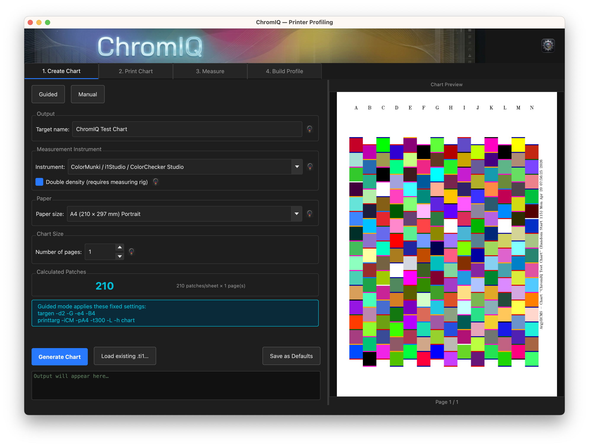
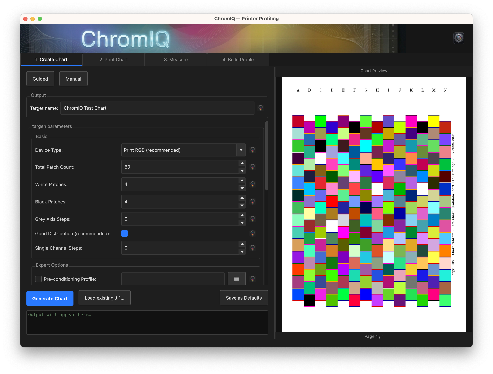
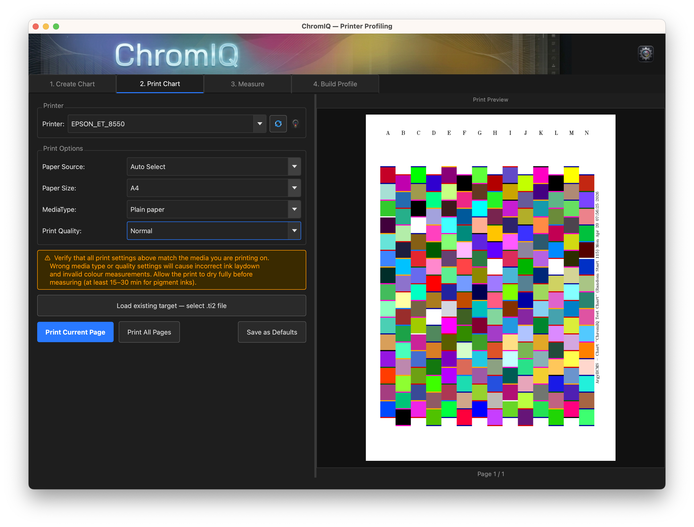
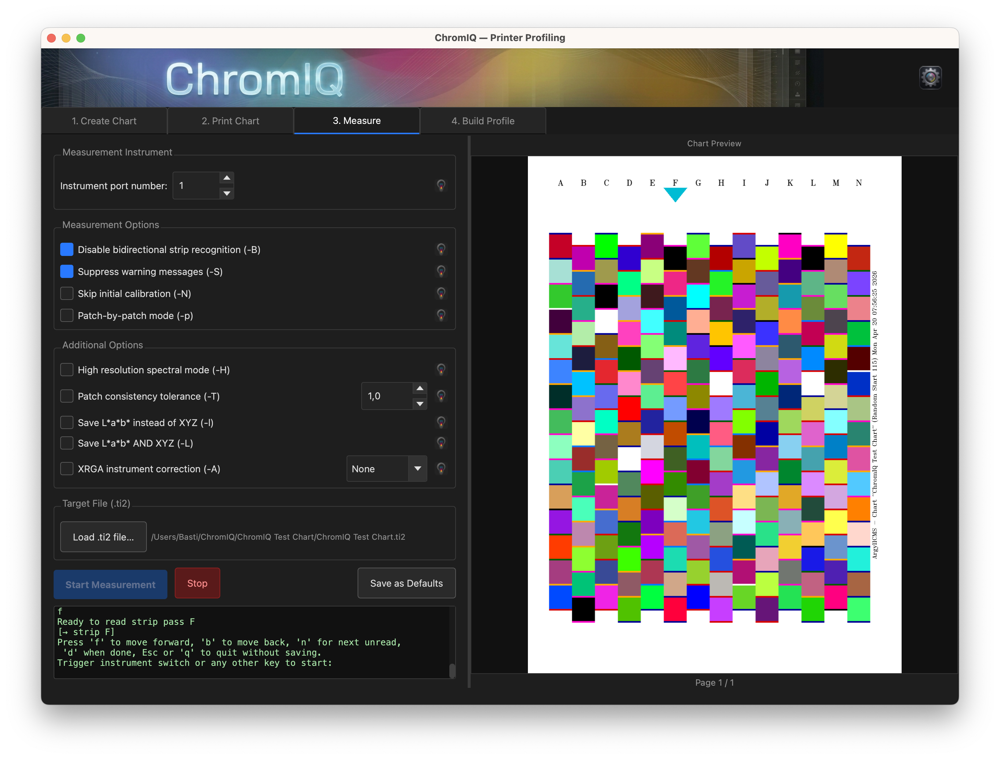
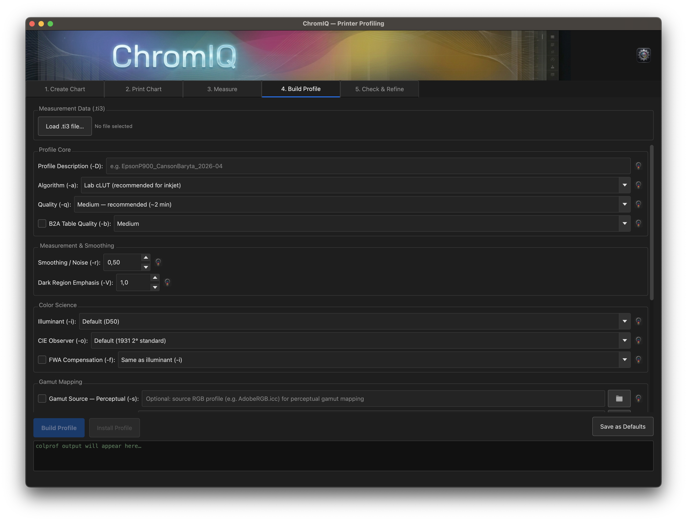

# ChromIQ

**ChromIQ** is a macOS desktop application for creating custom ICC profiles for RGB inkjet printers using [ArgyllCMS](https://www.argyllcms.com/). It provides a guided, step-by-step workflow that takes you from printing a test chart all the way through measuring it and building a ready-to-use ICC profile — without needing to touch the command line.

> **Status: Under active development.** Core functionality works end-to-end, but some features are still being refined and a few known issues remain. See [Known Issues](#known-issues) below.

---

## Screenshots

<!-- Screenshots will be added once the UI is more polished -->

| Step 1a — Create Chart (guided) | Step 1b — Create Chart (manual)  |
|---|---|
| |  |

| Step 2 — Print Chart | Step 3 — Measure Chart |
|---|---|
|  |  |

| Step 4 — Build Profile | Step 5 — Check & Refine |
|---|---|
|  | *screenshot coming soon* |

---

## Features

### Guided Workflow
ChromIQ walks you through the four steps of RGB printer profiling:

1. **Create Chart** — generates a test chart using `targen` and `printtarg`, with automatic patch count calculation for your instrument/paper combination
2. **Print Chart** — sends the chart TIFF directly to your printer via CUPS with configurable print options
3. **Measure Chart** — drives your spectrophotometer with `chartread` to measure the printed patches
4. **Build Profile** — runs `colprof` to generate a finished ICC profile

### Guided and Manual Modes
- **Guided mode** (Step 1): Select instrument, paper size, and number of pages — ChromIQ looks up the optimal patch count from an empirical database and sets sensible defaults automatically.
- **Manual mode** (Step 1): Full access to all `targen` and `printtarg` flags for advanced users.

### Instrument Support
| Code | Instrument |
|------|-----------|
| `i1` | X-Rite i1Pro / i1Pro 2 / i1Pro 3 |
| `p3` | X-Rite i1Pro 3 Plus |
| `CM` | X-Rite ColorMunki / i1Studio / ColorChecker Studio |
| `SS` | X-Rite SpectroScan (flatbed XY) |

### Paper Size Support
A4, A4 Landscape, A3, A3 Landscape, A2, US Letter, Letter Landscape, Legal, Tabloid (11×17)

### Key Capabilities
- Empirical patch capacity database (measured with Argyll 3.5.0) for instant lookup without binary search
- Separate patch counts for charts with and without the left clip border (`-L` flag)
- Double-density mode for ColorMunki/i1Studio with measuring rig (`-h` flag)
- Live TIFF preview of the generated test chart
- Direct TIFF printing via CUPS (no PostScript conversion, no ColorSync interference)
- Full `colprof` option set: illuminant, observer, FWA compensation, gamut mapping source profiles, rendering intent overrides
- Automatic file naming based on printer, paper, paper type, instrument, and timestamp
- Settings persist between sessions via `QSettings`
- Built-in ArgyllCMS binary tester and direct download link detection for your platform

---

## Requirements

### System
- macOS 12 Ventura or later (Apple Silicon and Intel supported)
- Python 3.11 or later
- [ArgyllCMS 3.1.0 or later](https://www.argyllcms.com/downloaddev.html) — binaries must be installed (default path: `/Applications/Argyll/bin`)

### Python dependencies
```
PyQt6 >= 6.6.0
Pillow >= 10.0.0
PyYAML >= 6.0
```

---

## Installation

### From source

```bash
git clone https://github.com/itsab1989/ChromIQ.git
cd ChromIQ
python3 -m venv .venv
source .venv/bin/activate
pip install -r requirements.txt
python main.py
```

### Build a standalone .app

```bash
source .venv/bin/activate
pip install pyinstaller
pyinstaller ChromIQ.spec
# Result: dist/ChromIQ.app
```

Copy `dist/ChromIQ.app` to `/Applications` and launch like any other macOS app. ArgyllCMS binaries are not bundled — install them separately and configure the path in Preferences.

---

## Usage

### First-time setup
1. Install ArgyllCMS and note the path to its `bin` folder (default: `/Applications/Argyll/bin`)
2. Open ChromIQ → **ChromIQ ▸ Preferences** (or ⌘,) and verify the binary path
3. Click **Test binaries** to confirm `targen`, `printtarg`, `chartread`, and `colprof` are found

### Step 1 — Create Chart
- Choose **Guided** or **Manual** mode
- In Guided mode: select your instrument and paper size, set the number of pages, and ChromIQ calculates the optimal patch count automatically
- Optionally toggle **Suppress left clip border (-L)** — suppressing it gains ~15 mm of printable width for extra patches; leave it on unless you use a physical paper-clip jig
- Click **Generate Chart** — the TIFF preview appears on the right when done

### Step 2 — Print Chart
- Select your printer from the dropdown (click ↺ to refresh the list)
- Configure paper slot, media type, and print quality if needed
- Use **No Color Adjustment** in your printer driver to bypass color management when printing
- Click **Print Page X** for each page of the chart

### Step 3 — Measure Chart
- The `.ti2` file from Step 1 is loaded automatically
- Follow the on-screen prompts from `chartread`
- Use **Enter/Space** to confirm each strip, **← →** to navigate, **ESC** to abort

### Step 4 — Build Profile
- Review the colprof settings (quality, algorithm, gamut mapping, etc.)
- Click **Build Profile** — the resulting `.icm` file is saved in the same folder as the chart
- Install the profile in macOS via **ColorSync Utility** or by double-clicking the `.icm` file

---

## Project Structure

```
ChromIQ/
├── main.py                    # Entry point
├── ChromIQ.spec               # PyInstaller build spec
├── requirements.txt
├── assets/                    # App icons and UI images
├── core/
│   ├── argyll_runner.py       # QProcess wrapper for ArgyllCMS tools
│   ├── file_manager.py        # Working folder and target name management
│   ├── logger.py              # Rotating file logger (~ChromIQ/chromiq.log)
│   ├── resource_path.py       # Asset path resolution for dev + frozen bundles
│   └── settings.py            # QSettings wrapper with typed defaults
├── data/
│   ├── parameters.yaml        # All targen/printtarg/colprof flags + tooltips
│   └── patch_db.py            # Empirical per-sheet patch capacity database
├── ui/
│   ├── main_window.py         # Top-level window, tab container, status bar
│   ├── parameter_widget.py    # Auto-generated flag widgets from parameters.yaml
│   ├── styles.py              # Fusion dark-theme QSS stylesheet
│   ├── tiff_preview.py        # Zoomable TIFF viewer widget
│   ├── tooltip_button.py      # ? icon with popover tooltip
│   ├── widgets.py             # Shared widget helpers (browse buttons, etc.)
│   ├── dialogs/
│   │   └── settings_dialog.py # Preferences dialog
│   └── tabs/
│       ├── tab_chart.py       # Step 1: chart creation
│       ├── tab_print.py       # Step 2: CUPS printing
│       ├── tab_measure.py     # Step 3: chartread measurement
│       └── tab_profile.py     # Step 4: colprof profile building
└── workflow/
    ├── chart_creator.py       # targen + printtarg orchestration
    ├── cups_printer.py        # lp command wrapper
    ├── measure_manager.py     # chartread orchestration
    ├── postscript_generator.py
    ├── print_manager.py       # Printer enumeration (lpstat)
    └── profile_builder.py     # colprof orchestration
```

---

## Configuration

All settings are stored via `QSettings` (macOS: `~/Library/Preferences/ChromIQ.ChromIQ.plist`) and can be adjusted in **Preferences**:

| Setting | Default | Description |
|---------|---------|-------------|
| ArgyllCMS bin path | `/Applications/Argyll/bin` | Directory containing the ArgyllCMS executables |
| Preferred instrument | i1Pro | Pre-selects instrument in Guided mode |
| Preferred paper size | A4 | Pre-selects paper in Guided mode |
| Output folder | `~/ChromIQ/` | Root folder for all chart/profile sessions |

Each session creates a subfolder named after the target (e.g. `~/ChromIQ/Canon_A4_Matte_i1_2025-04-18_14-30/`) containing all generated files for that run.

---

## How Patch Count Is Calculated

In **Guided mode** ChromIQ determines how many color patches to generate:

1. **Direct lookup** — for standard `patch_scale` (1.0) and `margin_mm` (6 mm), the empirical database in `data/patch_db.py` is consulted. Separate values are stored for charts with (`-L`) and without the left clip border.
2. **Binary search fallback** — for custom scale or margin settings, ChromIQ runs a series of quick `targen`/`printtarg` probes to find the maximum patch count that fits on a single page.

The database values were measured with Argyll 3.5.0 at 300 DPI. All common instrument/paper combinations are covered.

---

## Adding a New ArgyllCMS Parameter

Parameters are driven by `data/parameters.yaml` — no code changes needed:

```yaml
- tool: printtarg
  flag: "-x"
  type: bool
  default: false
  label: "Some new option"
  tooltip_title: "Some New Option (-x)"
  tooltip_body: "What this option does."
  expert_only: true   # optional: hide under Expert section
  no_space: false     # set true if value attaches directly to flag (e.g. -il not -i l)
```

Save the file and restart ChromIQ — the new parameter appears automatically in Manual mode.

---

## Known Issues

> This section will be updated as issues are resolved.

- **Printing (Step 2):** Direct TIFF printing via CUPS works, but color management behavior requires further testing.
- **Measurement (Step 3):** Some spectrophotometer models may require additional calibration steps not yet surfaced in the UI.
- **Profile (Step 4):** Advanced gamut mapping options (FWA, custom intents) are present in the UI but have not been fully tested across all instrument/paper combinations.
- **Windows/Linux:** Not tested. The app is developed and tested on macOS only. Linux support via CUPS is theoretically possible; Windows would require significant changes to the printing pipeline.

---

## Log File

ChromIQ writes a rotating log to `~/ChromIQ/chromiq.log` (max 2 MB, 3 backups). All ArgyllCMS commands and their full argument lists are recorded here at `INFO` level, which is useful for debugging unexpected behaviour.

---

## License

To be determined.

---

## Acknowledgements

ChromIQ is built on top of [ArgyllCMS](https://www.argyllcms.com/) by Graeme Gill — an outstanding open-source color management system. All color science heavy lifting is done by ArgyllCMS; ChromIQ is purely a GUI front-end.
